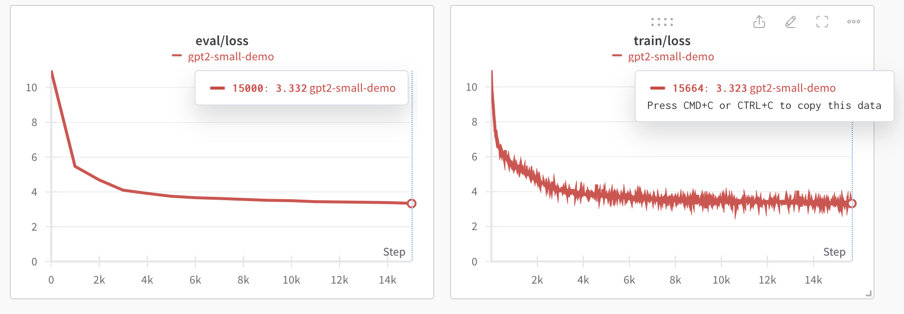
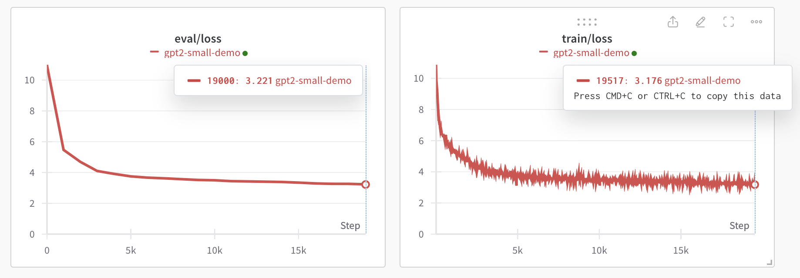

# Switching Hardware Mid-Training Run

One of the standout features of Levanter is its ability to seamlessly operate on both GPU and TPU platforms.
This feature allows for greater flexibility and adaptability in managing your training resources. In particular,
Levanter supports changing the number or type of accelerators mid-training while preserving the optimizer state, allowing
you to change the number of accelerators or even switch from a GPU server to a TPU VM instance or vice versa without losing your training progress!

The following guide will walk you through the steps and best practices for switching hardware configurations mid-training
run, ensuring a smooth and efficient training process for your models.

### Starting a Training Run

After getting setup up in your [GPU](Getting-Started-GPU.md) or [TPU](Getting-Started-TPU-VM.md) environment (please see [our tutorials](Installation.md) on how to do so if you haven't already), the following command will kick off a training run.

Let's say we want to train a GPT2-small model on the OpenWebText dataset on a single GPU machine with some number of GPUS.
We can do so with the following command:

```bash
python src/levanter/main/train_lm.py \
    --config_path config/gpt2_small.yaml \
    --trainer.checkpointer.base_path output/gpt2_small_webtext \
    --trainer.train_batch_size 256 \
    --trainer.checkpointer.save_interval 15min
```

In our example, we used 2 GPUs and a batch size of 256.

We have documentation on [getting started with training](Getting-Started-Training.md) in Levanter, the [configuration file](./reference/Configuration.md), and [training on your own dataset](Training-On-Your-Data.md) that you should check out for more details. We also have a notebook tutorial on [how to add FSDP to custom architectures](https://colab.research.google.com/drive/1QX4yH3zRFF3Xiibf1aahETcSQ5nbcUMz) implemented in Levanter with Haliax.

### How the Model Checkpoint is Saved
By default, checkpoints are saved every 15 minutes, and every 10000 training steps.
The frequency of time-based checkpoint saves can be adjusted by configuring the `checkpointer.save_interval` parameter in your training command.
(See the [configuration guide](./reference/Configuration.md) for more details on how to configure the checkpointer.)

This parameter accepts any reasonable time phrase (15min, 60s, etc.), that specifies the interval between each checkpoint save.

Whenever a checkpoint is saved, Levanter creates a new directory named after the training run ID within the path specified by `trainer.checkpointer.base_path`.
This directory stores the following information:

* the model's parameters
* the current optimizer and trainer states
* metadata on the current training step and the time the training step was saved

```
user@DN0a2335e6 rj96a79n/step-1591 % ls
metadata.json	model		training_state	worker-0.cert
```

Levanter's checkpoints are backed by [TensorStore](https://google.github.io/tensorstore/), which supports saving and
loading sharded checkpoints.

### Moving the Checkpoint File to Google Storage
Let's say that you've been training your model on a GPU server and want to switch to a TPU VM instance.

To switch to a new hardware configuration mid-training run, you need to move your checkpoint file and your training data
over to the new hardware environment. If you started your training run on a GPU server and want to move it to a TPU VM
instance, you can use the following command to upload your checkpoint file to a Google Cloud Storage bucket that your
TPU VM can access.

```bash
gsutil -m cp -r <GPU MODEL CHECKPT PATH> gs://<SOMEWHERE>
```
You need to be logged into your GCP account in your current environment for this command to run properly.
Information on how to set this up can be found [here](Getting-Started-TPU-VM.md).

### Reconfiguration
When transitioning to a new hardware setup, whether it's switching from GPU to TPU or adjusting the number of GPUs, we
recommend maintaining the same training batch size (`trainer.train_batch_size`) and number of train steps (`trainer.num_train_steps`) to prevent issues with the learning rate scheduler.

## Resuming A Training Run
Once your new hardware environment is set up and you've moved your training checkpoint over, you can resume your training run with this command:

```bash
python levanter/src/levanter/main/train_lm.py \
	--config_path levanter/config/gpt2_small.yaml \
	--trainer.load_checkpoint_path gs://<SOMEWHERE> \
	--trainer.wandb.resume true \
	--trainer.id rj96a79n
```
Use `trainer.load_checkpoint_path` to specify where the model checkpoint you moved is located. `trainer.wandb.resume true` will resume all your learning curves where the stopped training run left off, and `trainer.id` is the trainer ID used by WandB to identify your stopped training run.

## Picking Up Where You Left Off
When your training run resumes, the trainer will first fast-forward through your training data to continue from the exact point in the epoch where your checkpoint was saved. You should see a progress bar tracking the fast-forward through your data.

Resuming your training run restores your checkpoint's optimizer states, so your WandB learning curves should resume smoothly from where they left off.

Loss curve when training was stopped on 2 GPUs:


Loss curve after resuming training on a TPU v3-32 VM instance:



As you can see, the loss curve resumes smoothly from where it left off, and the model continues to learn without trouble.
Now you can continue training your model on your new hardware setup!

## Best Practices

### Gradient Accumulation

If you drastically reduce the number of accelerators (or change to accelerators with much less memory in aggregate),
you may find you run out of memory. A common solution to this is to use gradient accumulation. Gradient accumulation
is a technique where you accumulate gradients over multiple batches before updating the model.

You can make Levanter use gradient accumulation by setting `trainer.per_device_parallelism` to the maximum number
of examples that fit on your accelerator. (By default, Levanter uses `per_device_parallelism=${train_batch_size}/${num_devices}`
when there's no model parallelism.)
