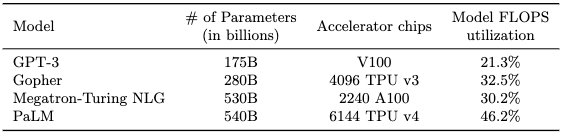
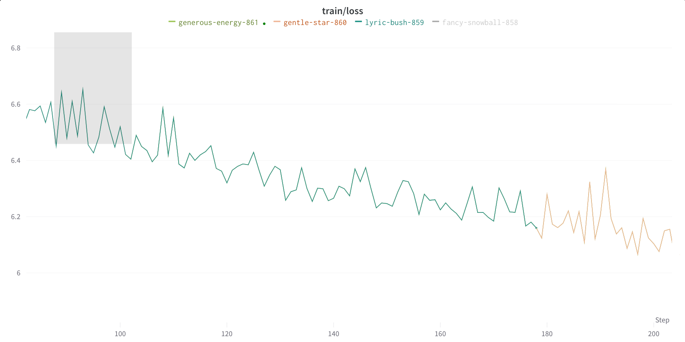

# Levanter 1.0 Release Announcement

We are excited to announce the release of [Levanter](https://github.com/stanford-crfm/levanter), a new [JAX](https://github.com/google/jax)-based codebase for training foundation models.
Levanter is designed to be legible, scalable, and reproducible:

1. **Legible**: Levanter comes with a new named tensor library named Haliax that makes it easy to write easy-to-follow, composable deep learning code, while still being high performance.
2. **Scalable**: Levanter is designed to scale to large models, and to be able to train on a variety of hardware, including GPUs and TPUs.
3. **Reproducible**: Levanter is bitwise deterministic, meaning that the same configuration will always produce the same results, even in the face of preemption and resumption.

Today, we're releasing the Levanter v1.0, along with [tutorials](https://colab.research.google.com/drive/1TiTcQQ4V5mopbgCu1SVl-oqJtXn7rFnC)
and checkpoints for a number of models, including new architectures, on our [Hugging Face Hub](https://huggingface.co/stanford-crfm) page.
(Please see John Thickstun and coauthors' [blog post](https://crfm.stanford.edu/2023/06/16/anticipatory-music-transformer.html) on
the super-cool [Anticipatory Music Transformer](https://johnthickstun.com/assets/pdf/anticipatory-music-transformer.pdf), which is one of the models we've trained with Levanter.)

We hope that Levanter will be useful to the community, and we welcome contributions and feedback. Please join us on [GitHub](https://github.com/stanford-crfm/levanter)
or on the (unofficial) [JAX LLM Discord](https://discord.gg/CKazXcbbBm)!

## The Landscape of Foundation Model Training Frameworks

Many foundation model training frameworks exist in the community, each with its strengths and focuses.
For large language models (LLMs) (the focus of this release),
the most well-known in the open source community is probably NVIDIA's PyTorch-based [Megatron-LM](https://github.com/NVIDIA/Megatron-LM),
and its many derivatives, including EleutherAI's [GPT-NeoX](https://github.com/EleutherAI/gpt-neox) codebase.
Andrej Karpathy has released [minGPT](https://github.com/karpathy/minGPT), a PyTorch-based library that aims
to be minimal and legible.
Meta has [MetaSeq](https://github.com/facebookresearch/metaseq) as well as [FairScale](https://github.com/facebookresearch/fairscale),
with which they trained [Llama](https://github.com/facebookresearch/llama).
MosaicML has released [LLM Foundry](https://github.com/mosaicml/llm-foundry), which we used to train
[BioMedLM](https://crfm.stanford.edu/2022/12/15/biomedlm.html) last autumn. Previously, we released [Mistral](
https://github.com/stanford-crfm/mistral) built on [Hugging Face Transformers](https://github.com/huggingface/transformers/)
and [DeepSpeed](https://github.com/microsoft/DeepSpeed). There are, to be sure, many more.

In the JAX community, there are a number of libraries popping up. Google has released [T5X](https://github.com/google-research/t5x)
and [MaxText](https://github.com/google/maxtext). Salesforce has released the Haiku-based [JAXformer](https://github.com/salesforce/jaxformer).
There are also a number of independent libraries, including [EasyLM](https://github.com/young-geng/EasyLM)
and [JAXSeq](https://github.com/Sea-Snell/JAXSeq), both of which are based on [Flax](https://github.com/google/flax/)
and modified implementations from [Hugging Face Transformers](https://github.com/huggingface/transformers/).  Previously, Eleuther AI released
[mesh-transformer-jax](https://github.com/kingoflolz/mesh-transformer-jax/), though it is mostly unmaintained now and uses
older, quasi-deprecated JAX APIs for distributed training.

## A New Codebase for Training Foundation Models

Despite the wide array of existing frameworks, when we started, we found that none of them fully addressed our needs.
At CRFM, we focused on three fundamental goals:

1. **Legibility**: We prioritize writing code that is easy to read, understand, and compose.
2. **Scalability**: We want to fully utilize the compute we had available, including TPUs and NVIDIA GPUs.
3. **Reproducibility**: We want to be able to reproduce results *exactly*; that is, we want **bitwise determinism**, even in the face of preemption and restarts from checkpoints.

We chose [JAX](https://github.com/google/jax/) as our framework because it is powerful, flexible, and performant,
and offers strong reproducibility guarantees. JAX also works well on TPUs, while we found that PyTorch support was still uneven.
JAX is also a natural choice because it allows you to focus on the "what" of your code, and not on the "how": details of
partitioning and communication can be left to the XLA compiler. Finally, JAX makes reproducibility easy, since it uses
bitwise deterministic PRNGs by default along with careful control over the PRNG state.

However, JAX is a low-level framework, and we found that, by itself, it did not provide the legibility that we wanted.
We therefore created two new libraries: **Haliax** and **Levanter**. Haliax is a named tensor library that focuses on
improving the legibility of deep learning code while still being high performance. Levanter is a library for training
foundation models built on top of Haliax that offers bitwise reproducibility, meaning that the same code with the same data
will produce the exact same result, even in the presence of preemption and restarts. Levanter also incorporates a number of
features that we found useful for training foundation models: online, but cached, data preprocessing; sharded data loading;
WandB integration; distributed checkpointing; automatic export to the Hugging Face Hub; and more.

In the rest of this blogpost, we'll give a more detailed overview of Haliax and Levanter, and then we'll show how to
use them to train a language model.

# Legibility: Named Tensors with Haliax

Haliax is a library for named tensors, a powerful abstraction where the axes of tensors are given names, and operations
on those tensors use those names, rather than using positions (0, 2, -1). These names help make your code more legible, more composable, and less
bug-prone. In Haliax, they also form the basis of how we implement
[Fully-Sharded Data Parallel](https://engineering.fb.com/2021/07/15/open-source/fsdp/) training and tensor parallelism,
as we'll see below in the section on scalability.

Haliax is built on JAX and [Equinox](https://github.com/patrick-kidger/equinox),
which is a neural network library that provides a familiar, PyTorch-like module structure. Haliax uses
Equinox's module structure for its neural network library, rather than Flax or Haiku. (Please see our
[tutorial](https://colab.research.google.com/drive/1TiTcQQ4V5mopbgCu1SVl-oqJtXn7rFnC?usp=sharing)
for an introduction to Haliax's neural network modules, which also introduces the relevant parts of Equinox.)

Haliax is modeled on Alexander Rush's [Tensor Considered Harmful](https://nlp.seas.harvard.edu/NamedTensor),
which argues that named tensors are a better abstraction than the position-based tensors that are the default in deep learning.
In particular, he argues that:

* Named axes are more semantically meaningful and rely less on bitrot-prone comments.
* Named axes allow you to abstract over unreferenced dimensions, making code more flexible.
* Broadcasting leads to unreadable strings of `reshape`s, `transpose`s, `view`s and (`un`)`squeeze`s that obfuscate the intent of the code.

We also contend that positional code is more bug-prone: those `transpose`s and `reshape`s are easy to get wrong,
resulting in silent bugs that are hard to catch. NumPy-style implicit broadcasting, also common in positional code, can lead to
similarly easy-to-miss bugs.

## A Simple, but Incorrect, Example with Positional Axes

As an example, let's consider the following simple linear model. Before reading on, try to spot the bug:

```python
import jax.numpy as jnp
import jax.random as jrandom
from jax.random import PRNGKey

# predict y from x using  a linear model (W)
# (In JAX, you pass in the PRNGKey to get reproducible random numbers)
x = jrandom.uniform(PRNGKey(0), (128, 64))
y = jrandom.uniform(PRNGKey(1), (128,))
W = jrandom.uniform(PRNGKey(2), (64, 1))

def mse(pred, target):
    return jnp.mean((pred - target) * (pred - target))

y_pred = x @ W
mse(y_pred, y)
```

This code appears straightforward, but it's incorrect: the dimensions of `y_pred` and `y` are not the same.
Because `y_pred` is a 2D array of shape `(128, 1)`, and `y` is a 1D array of shape `(128,)`, the `-` operator will broadcast `y` to shape `(128, 128)`.
(This makes the subtraction an "outer product"-like operation rather than the intended elementwise subtraction.)
But, you won't get an error at runtime; this is a silent bug. The `mean` call hides the bug by averaging over all values.
You get the wrong answer, but you likely won't notice.

This is a common bug in deep learning code, and it's easy to miss. We, and anecdotally many others we have spoken to, have
individually lost multiple days to this exact bug, and it shows up in every library with NumPy's broadcasting semantics.

But if we use named tensors, we avoid this bug without having to think about it. Here's what this code looks like in Haliax:

```python
import haliax as hax
from jax.random import PRNGKey

Batch = hax.Axis("batch", 128)
Feature = hax.Axis("feature", 64)

x = hax.random.uniform(PRNGKey(0), (Batch, Feature))
y = hax.random.uniform(PRNGKey(1), Batch)
W = hax.random.uniform(PRNGKey(2), (Feature,))

def mse(pred, target):
    return hax.mean((pred - target) * (pred - target), axis=Batch)

y_pred = hax.dot(x, W, axis=Feature)
mse(y_pred, y)
```

In this example, we've defined an axis for each dimension of our tensors. The basic building block in Haliax is the named
`Axis`, which pairs a name with a size. We can then use these axes to define our tensors, and
to perform operations like `dot` and `mean`. (As in NumPy, the `dot` function performs generalized matrix multiplication.)
In this example, we've defined `x` to be a 2D tensor with axes
`Batch` and `Feature`, `y` a 1D tensor with axis `Batch`, and `W` a 1D tensor with axis
`Feature`. When we perform the dot product, we specify that we want to contract over the `Feature` axis, the
`mean` operation is performed over the `Batch` axis, and the subtraction is performed elementwise. Because the names
of the axes match, the code is correct. By using named tensors, we've made it impossible to have this bug.

## Another Example: Attention

Let's consider another example, this time focusing more on legibility. We'll look at two attention implementations:
the one in [minGPT](https://github.com/karpathy/minGPT/) and a version of attention in Haliax.

### minGPT's Attention Implementation

minGPT is a PyTorch implementation of GPT-2, designed to be pedagogical and easy to understand. Here's the
 [implementation of attention](https://github.com/karpathy/minGPT/blob/90420ee/mingpt/model.py#LL61C8-L67C101).
(We'll omit the dropout bit for the sake of exposition.)

```python
    # causal self-attention; Self-attend: (B, nh, T, hs) x (B, nh, hs, T) -> (B, nh, T, T)
    att = (q @ k.transpose(-2, -1)) * (1.0 / math.sqrt(k.size(-1)))
    att = att.masked_fill(self.bias[:,:,:T,:T] == 0, float('-inf'))
    att = F.softmax(att, dim=-1)
    y = att @ v # (B, nh, T, T) x (B, nh, T, hs) -> (B, nh, T, hs)
    y = y.transpose(1, 2).contiguous().view(B, T, C) # re-assemble all head outputs side by side
```

The code's intent is obscured by all the shape manipulation: the transposes and views and slices.
What axis is the `(q @ k.transpose(-2, -1))` expression multiplying out? What is that last `transpose` doing? The comments help, but they have to be maintained
or risk becoming out of date.

Still worse, if the final `transpose(1, 2)` were accidentally omitted, the code would still run without any exception,
but the output would be incorrect. This is another example of the silent, sneaky bugs endemic to positional axis code.

We don't mean to pick on minGPT too much; it's a great codebase, and more legible than most. Indeed, it's a testament to
the inherent difficulty of writing legible code with positional axes.

### Attention in Haliax

Now let's consider an attention implementation written in Haliax.

```python
import jax.numpy as jnp
import haliax as hax

# Named Axes for Tensor Dimensions
Pos = hax.Axis("position", 1024)  # sequence
KPos = Pos.alias("key_position")  # key sequence for attention
Head = hax.Axis("head", 8)  # number of attention heads
Key = hax.Axis("key", 64)  # key/query/value size
Embed = hax.Axis("embed", 512)  # embedding size

def attention(Key, KPos, query, key, value, mask):
    # how similar is each query to each key
    scores = hax.dot(query, key, axis=Key) / jnp.sqrt(Key.size)

    # mask out invalid positions
    if mask is not None:
        scores -= 1E9 * (1.0 - mask)

    # convert to probabilities
    scores = hax.nn.softmax(scores, axis=KPos)

    # weighted sum of values
    return hax.dot(scores, value, axis=KPos)
```

With named tensors, we can write the code in a way that conveys the semantics of the operation, rather than the
mechanics of the shape manipulation. In addition, this named code is much more flexible, as we'll see below.

## Generalizing to Attention Variants

The minGPT code above is batched and multi-headed. Indeed, it is obligatorily so: the batch and head axes are
hard-coded into the shape of the tensors and the indices of the operations.

By contrast, our Haliax implementation makes no reference to either a `Batch` or `Head` axis. And indeed,
it can operate on tensors that have neither of those axes. However, it is also batch-capable and supports multi-headed
(or multi-query) attention. It even supports attending to or from non-sequential keys (e.g. attending to image patches).
Because the code is written in terms of named axes, the code immediately generalizes to all these variants:

```python
Batch = hax.Axis("batch", 8)  # batch size

query = hax.random.normal(PRNGKey(0), (Batch, Head, Pos, Key))
key = hax.random.normal(PRNGKey(1), (Batch, Head, KPos, Key))
value = hax.random.normal(PRNGKey(2), (Batch, Head, KPos, Key))

# traditional batched multi-headed attention
assert attention(Key, KPos, query, key, value, mask=None).axes == (Batch, Head, Pos, Key)

# multi-query attention. Each key/value pair produces only one head
key = hax.random.normal(PRNGKey(1), (Batch, KPos, Key))
value = hax.random.normal(PRNGKey(2), (Batch, KPos, Key))
assert attention(Key, KPos, query, key, value, mask=None).axes == (Batch, Head, Pos, Key)

# image patch cross-attention from a sequence
Height = hax.Axis("height", 32)
Width = hax.Axis("width", 32)

key = hax.random.normal(PRNGKey(1), (Batch, Head, Height, Width, Key))
value = hax.random.normal(PRNGKey(2), (Batch, Head, Height, Width, Key))

# KPos in attention can actually be a tuple of axes.
assert attention(Key, (Height, Width), query, key, value, mask=None).axes == (Batch, Head, Pos, Key)
```

This automatic generalization is possible because we've abstracted over the unreferenced dimensions of our tensors.
In the first example, both the `Batch` and `Head` axes are unreferenced, so they are automatically "batched" over,
similar to how [`bmm`](https://pytorch.org/docs/stable/generated/torch.bmm.html) works in PyTorch.
In the second example, we omit the `Head` axis from the `key` and `value` tensors, yielding a multi-query attention
where we only have multiple heads for the `query` tensor.
In the third example, we can use tuples of axes in many places where we would normally use a single axis.

## Named Tensors Elsewhere
JAX already has some built-in support for named tensors in the form of [`xmap`](https://jax.readthedocs.io/en/latest/notebooks/xmap_tutorial.html), which uses something like `vmap`/auto-batching to implement tensors that have both positional and named axes.
We were initially excited about `xmap` when we first encountered it, but 1) they seem to be deprioritizing it (in favor of `pjit`)
and 2) ultimately `xmap` can be confusing because you write non-named code for positional axes, then add names "outside"
of the main model code itself. Ultimately, we found it harder reason about this mixed positional/named code (where the axis names are implicit)
than just using names the whole way through. That said, `xmap`'s mapping between "semantic" and "physical" axes as the
basis for parallelism is the inspiration for how we do parallelism in Haliax.

Flax supports a logical-to-physical axis mapping thing similar to what's in Haliax. However, the arrays don't carry around
their axis names, so you have to remember them and pass them in manually when doing partitioning for data parallelism,
tensor parallism and FSDP. To us, this seems like a bit of a missed opportunity (relative to what we have in Haliax), but it's
still useful.

Haliax's NamedArrays are probably most similar to [Mesh-Tensorflow](https://github.com/tensorflow/mesh),
which has a separate `Dimension` class analogous to our `Axis` class, and uses them to implement mesh parallelism
similar to what's in JAX (and what we use in Haliax).

PyTorch has [Named Tensors](https://pytorch.org/docs/stable/named_tensor.html). They're fairly new and "bolted on" to
the existing positional tensors.
They also don't help with data or model partitioning, which is one of the main use cases for named axes in
Haliax, as we'll see below.
Tongfei Chen's Scala-and-PyTorch [Nexus](https://tongfei.me/nexus/) library also has named tensors,
going so far as to offer static typing for tensor axes.

# Scalability with Named Tensors

We have seen how named tensors can improve *legibility*, but they can also help make *scalability* easy, by enabling us
to separate the concerns of our model's logic and how we intend to scale it. Named tensors are the basis of our approach to scalability, including
our [Fully-Sharded Data Parallel](https://engineering.fb.com/2021/07/15/open-source/fsdp/)
implementation as well as for tensor parallelism. FSDP can be added to a training loop with about 10 lines of code, and
those same 10 lines can also enable tensor parallelism.
We have used Levanter to train models as large as 6.7B parameters on a TPU v3-256, and we have run
experiments showing that our approach is capable of training 65B parameters on a TPU v3-256, though it would take quite a while to train.

## Fully-Sharded Data Parallel in 10 Lines of Code

FSDP with Haliax basically amounts to telling Haliax which named axes to shard, and specifying a different sharding for computation than for storage.
Haliax will then translate that code to the relevant JAX primitives, and handle the sharding for you.
A full tutorial is available [here](https://colab.research.google.com/drive/1QX4yH3zRFF3Xiibf1aahETcSQ5nbcUMz?usp=sharing), but here's a quick example:

```diff
+# describe how we shard our parameters and our data
+# We store our parameters and optimizer states fully sharded along the embed axis (the hidden state of our transformer)
+param_mapping = {"embed": "data"}
+# During computation, we instead shard our data along the batch axis, and gather the parameters just-in-time
+data_mapping = {"batch": "data"}

+# tell Haliax to shard our model and optimizer states
+@hax.named_jit
def init_model():
-    return MyModel()
+    return hax.shard_with_axis_mapping(MyModel(), param_mapping)

model = init_model()

# initialize optimizer
import optax
optimizer = optax.adamw(1E-4, weight_decay=0.1)

+@hax.named_jit
def init_optimizer(model):
    opt_state = optimizer.init(model)
-    return opt_state
+    return hax.shard_with_axis_mapping(opt_state, param_mapping)

optimizer = init_optimizer(model)

+@hax.named_jit
def train_step(model, opt_state, input_ids):
    ... # elided for brevity

    # ensure that intermediate states are sharded correctly
-    loss, grads = grad_loss(model, input_ids)
+    with hax.axis_mapping(data_mapping):
+        loss, grads = grad_loss(model, input_ids)

    ...
    return loss, model, opt_state

# ...

for data in data_iter:
+    data = hax.shard_with_axis_mapping(data, data_axis_mapping)
    ...
```

This is all that is required to shard a model and optimizer across multiple GPUs or TPUs.
The rest of the training loop remains unchanged.
You can do fancier things like sharded data loading (which we do in Levanter), but the basic idea is the same.

The key components are:
* `haliax.shard_with_axis_mapping`, a function that takes an array or model and a mapping from axis names to "physical" axes and shards the array/model accordingly.
* `haliax.axis_mapping`, a context manager that specifies how we shard intermediate states during computation.
* `param_mapping`, a `dict` that specifies how we shard our parameters and optimizer states. We shard along the `embed` axis, which is the hidden state of our transformer.
* `data_mapping`, a `dict` that specifies how we shard both our inputs and intermediate states during computation.

## Tensor Parallelism in the Same 10 Lines of Code

Let's further add tensor parallelism to our model. All we have to do is change the axis mappings:

```diff
# Specify which axes we shard for tensor parallelism:
# specifying "head" shards attention and "mlp" shards the feedforward
+tensor_parallel_mapping = {"head": "model", "mlp": "model"}
# We store our parameters and optimizer states fully sharded along the embed axis
-param_mapping = {"embed": "data"}
+param_mapping = {"embed": "data", **tensor_parallel_mapping}
# During computation, we instead shard our data along the batch axis, and gather the parameters just-in-time
-data_mapping = {"batch": "data"}
+data_mapping = {"batch": "data", **tensor_parallel_mapping}
```

That's it! We can now use a combination of tensor parallelism and FSDP to scale our model to as many GPUs or TPUs as we want.
By comparison, in PyTorch, there are usually significant changes to the model required to add tensor parallelism,
including replacing the right set of `Linear` layers with modified versions that do communication.


## Training Performance on TPU

To demonstrate the scalability of our FSDP implementation, we ran benchmarks to estimate our Model Flop Utilization (MFU)
and Hardware Flop Utilization (HFU; as measured by the profiler) on a TPU v3-256.  We used a GPT-2 architecture for all
experiments. (The exact hyperparameters of these transformers are available in our repository; they are the usual configurations used for models of the relevant scale.)

<!--(HFU is basically the percentage
of the TPU's peak flops that we are able to utilize, while MFU is roughly the percentage of the hardware's FLOPs
that are used for computing the model's forward and backward passes, not including gradient checkpointing or other
such things. You can think of HFU as our ability to keep the TPUs warm, and MFU as our ability to
extract useful work.) -->

| Model Size | MFU   | HFU   |
|------------|-------|-------|
| 345M       | 35.1% | 51.4% |
| 750M       | 38.9% | 54.7% |
| 1.4B       | 41.7% | 55.6% |
| 6.7B       | 47.3% | 71.5% |
| 13B        | 54.4% | 77.1% |
| 20B        | 50.9% | 53.8% |
| 65B        | 44.6% | 55.5% |

The smaller models underutilize the hardware, but the larger models are better able to saturate the TPU v3-256.
To help contextualize these numbers, on the next-generation **TPU v4-128**s and with a slightly different 22B parameter model,
the performance-focused [MaxText](https://github.com/google/maxtext) library
[gets MFU](https://github.com/google/maxtext#runtime-performance-results) between 53.2% and 56.7%. Our nearest neighbor at 20B is somewhat lower
but roughly in the same ballpark;
we hope to improve this in the future, partially by using their tricks...

Though the hardware is different, we can also compare to the [very large table of results](https://github.com/mosaicml/examples/tree/release/v0.0.4/examples/llm/throughput#a100-80gb)
from [MosaicML](https://www.mosaicml.com/), whose numbers are generally in the 45-55% range for MFU and 55-65% range for HFU. Our results are in the same ballpark, though
our highest numbers are not as high as theirs. In part, this is because they use [Flash Attention](https://arxiv.org/abs/2205.14135) and they
can avoid gradient checkpointing at lower scales (which is easier to do on the higher-memory A100s); these changes improve MFU.

For other comparisons (to much larger models trained on much larger clusters), we can compare to the table from the [PALM paper](https://arxiv.org/pdf/2204.02311.pdf), to give
a rough sense of how our results compare to other work:



FSDP is likely to perform less well on clusters of the sizes in this table (i.e., a few thousand TPUs or GPUs), since it requires more communication than other approaches.
However, at our scale, we find that FSDP is better than either tensor parallelism or a combination of FSDP and tensor parallelism.
We leave pipeline parallelism and more thorough comparisons as future work.

Our results here demonstrate that you can get good scalability in a highly legible codebase, with the logic of the model decoupled
from the logic of parallelism.
We of course cannot claim full credit for these results: they build on the excellent work of the JAX, XLA, and TPU teams,
as well as all the algorithmic and hardware improvements that they themselves build on. Nevertheless, we hope that our work makes it easier
for others to experiment with models at larger scales than they otherwise would have.


# Reproducibility: Bitwise Determinism with Levanter and JAX

After legibility and scalability, we have reproducibility, which JAX helps with enormously. In particular, JAX's fine-grained
control over PRNG states makes it easy to ensure bitwise determinism.
Levanter takes advantage of this to offer bitwise reproducibility for training runs, even after preemption. That is,
the same run with the same code on the same hardware configuration (e.g. a v3-32 or a v3-256) will produce the exact same loss curve, even if it is
preempted and resumed multiple times. As an example, here is a screenshot of a training run being resumed multiple times, even on different TPU pod slices:



The fact that you can't make out the different lines is the point: the training runs are bitwise identical,
a huge advantage for debugging and reproducibility. For instance, loss spikes are not uncommon when training large models,
and it can be difficult to tell whether a spike is due to a bug, data, optimizer state, or just bad luck with the random
number generator. Without bitwise reproducibility, investigating these issues is challenging because you can't rewind and replay
your training run's state to the time of the spike. If you make an adjustment without bitwise reproducibility, you can't tell whether it
fixed the problem, or whether the problem went away randomly.

### Experimental Setup Logging and Checkpointing

Levanter also logs everything necessary to exactly reproduce a run: the git SHA, code, configuration,
and a pip-freeze of the environment. Checkpoints serialize the entire model state, including the optimizer state,
as well as the "main" PRNG state, which is used to generate the other PRNG states. This means that you can
exactly reproduce a run by simply checking out the git SHA, installing the dependencies, and running the code (on the same
hardware configuration).

# Other Features in Levanter

Beyond our three pillars of legibility, scalability, and reproducibility, Levanter also has a number of other
features that make it easier to train large models. We describe some of them here.

## Data Preparation and Visualization

During our collaborations with teams to build domain-specific models, we have found that data preparation can be a significant challenge.
Indeed, it is often the biggest challenge.
In particular, we have found that users want to iterate quickly on different data formats (and more
generally the entire [ETL pipeline](https://en.wikipedia.org/wiki/Extract,_transform,_load)).
Moreover, it can be difficult to visualize the effects of different preprocessing options on the data. To address this,
we have built two features into Levanter: cached on-demand data preprocessing and live visualization during training.

### Cached On-Demand Data Preprocessing

Training a language model involves taking a large corpus of text and converting it into a sequence of integers called tokens.
When training large autoregressive models, it is typical to concatenate (or "pack") short sequences and break apart longer sequences
so that the resulting sequences are all the same length.

Data preprocessing is done in one of two ways: either it is performed offline as a separate preprocessing step, or it is
performed streaming, so that the data is processed on-the-fly as it is being used for training. The former is typically
faster, but the latter is more flexible, since it allows you to iterate on the data format without having to reprocess
the entire data set as a preprocessing step. However, streaming, especially when coupled with sequence packing, is difficult to pair with
resuming from preemption, since the data stream must be restarted from the beginning (or one must take care to track byte offsets).

In Levanter, we take a hybrid approach. We preprocess the data online, but we cache the results of preprocessing so
that resumes are much faster and so that subsequent runs are even faster. As soon
as the first part of the cache is complete, Levanter will start training, and will continue to preprocess the rest of
the data in the background. This allows us to start training as soon as possible, while still allowing us to iterate
on the data format. Moreover, we can resume from preemption without having to reprocess the entire data set.
Our cache format also allows for iterating on sequence length without retokenizing, which in our experience is a commonly requested feature.

Levanter's preprocessing works by spinning up a [Ray cluster](https://www.ray.io/) using the hosts being used for training,
exploiting the typically impressive CPUs of those machines to preprocess data.
This is especially useful for large datasets like [The Pile](https://pile.eleuther.ai/) or the [Red Pajama](https://github.com/togethercomputer/RedPajama-Data) data set.

Preprocessing can also be performed offline using a Ray cluster, or on a single machine. In all cases, the caches
produced by preprocessing are fully reproducible, so that we can assure bitwise reproducibility even when preprocessing
is performed on different machines.

Levanter works out of the box with either [Hugging Face Datasets](https://huggingface.co/datasets) (including streaming) or urls of (compressed)
jsonl files. Caches can be stored in any fsspec-compatible file system, including GCS and local file systems. We use
[Hugging Face Tokenizers](https://huggingface.co/docs/tokenizers/) for tokenization.

### Live Visualization during Training

Levanter also provides a feature for visualizing the probability of each token in a sample of the validation set during training.
When training large models, it can be difficult to get a sense of how the model is learning. This is especially true
when training on novel datasets. As an example, we have seen issues with early versions of new datasets where the
model had suspiciously low loss.

The visualization produces a heatmap of the log probability of each token in a sample of the validation set
that is updated periodically during training. Here is an example of the token probability visualization in action on a
small, quick training run:


The darker, more purple the color, the lower the probability of the token. The lighter, more yellow the color, the higher the probability.
This visualization is logged to WandB as training progresses and can be viewed interactively. We have found this to be a
nice alternative to just staring obsessively at the loss curve (not that we ever do that).

In the past, we have used our visualization to identify a pattern of highly but not perfectly redundant data in a new data set
(what we call "madlib duplicates"), suggesting that the model is "wasting" time and context length on low-value data.
We've also used it to qualitatively assess how alternative architectures (like [Backpacks](http://backpackmodels.science/))
learn differently from Transformers.

## A few other features

* **Training**: Levanter uses [Optax](https://github.com/deepmind/optax) for optimization,
  though our new optimizer, [Sophia](https://arxiv.org/abs/2305.14342), is coming to Levanter soon!
* **Logging**: Logging is done with [WandB](https://wandb.ai/), complete with a fancy online visualization of the validation set during training.
* **Checkpointing**: Distributed checkpointing is supported via Google's [TensorStore](https://google.github.io/tensorstore/) library. Training can even be resumed on a different number of hosts, though this breaks reproducibility for now.
* **Export**: We also support exporting models to the Hugging Face Hub, with export compatible with Pytorch and Transformers via [SafeTensors](https://github.com/huggingface/safetensors).
* **Stability**: The GPT-2 implementation uses the [Mistral stability trick](https://crfm.stanford.edu/2021/08/26/mistral.html) to improve stability during training.

# Getting Started with Levanter

To get started, first install the appropriate version of JAX for your system. See [JAX's installation instructions](https://github.com/google/jax/blob/main/README.md#installation) as it varies from platform to platform.

If you're using a TPU, more complete documentation for setting that up is available [here](Getting-Started-TPU-VM.md). GPU support is still in-progress; documentation is available [here](Getting-Started-GPU.md).

Next, clone the repository and install it with pip:

```bash
git clone https://github.com/stanford-crfm/levanter.git
cd levanter
pip install -e .
wandb login  # optional, we use wandb for logging
```

## Training a GPT2-nano
As a kind of hello world, here's how you can train a GPT-2 "nano-sized" model on the small [WikiText-103](https://blog.einstein.ai/the-wikitext-long-term-dependency-language-modeling-dataset/) dataset:

```bash
python -m levanter.main.train_lm --config_path config/gpt2_nano.yaml

# alternatively, if you didn't use -e and are in a different directory
python -m levanter.main.train_lm --config_path gpt2_nano
```

## Training a GPT2-small on your own data

If your dataset is a [Hugging Face dataset](https://huggingface.co/docs/datasets/loading_datasets.html), you can use the `data.id` field to specify it:

```bash
python -m levanter.main.train_lm --config_path config/gpt2_small.yaml --data.id openwebtext

# optionally, you may specify a tokenizer and/or a cache directory, which may be local or on gcs
python -m levanter.main.train_lm --config_path config/gpt2_small.yaml --data.id openwebtext --data.tokenizer "EleutherAI/gpt-neox-20b" --data.cache_dir "gs://path/to/cache/dir"
```

If instead your data is a list of URLs, you can use the `data.train_urls` and `data.validation_urls` fields to specify them.
Data URLS can be local files, gcs files, or http(s) URLs, or anything that [fsspec](https://filesystem-spec.readthedocs.io/en/latest/) supports.
Levanter (really, fsspec) will automatically uncompress `.gz` and `.zstd` files, and probably other formats too.

```bash
python -m levanter.main.train_lm --config_path config/gpt2_small.yaml --data.train_urls ["https://path/to/train/data_*.jsonl.gz"] --data.validation_urls ["https://path/to/val/data_*.jsonl.gz"]
```

You can also change the dataset by changing the `dataset` field in the config file.

## Next Steps

Please see the [README for Levanter](https://github.com/stanford-crfm/levanter#installing-levanter) for
details, including training with the other supported architectures (currently, [Backpacks](http://backpackmodels.science/) and MosaicML's [MPT](https://www.mosaicml.com/blog/mpt-7b)),
as well as for training on TPUs and GPUs.

## Haliax Tutorials

We have two Colab tutorials for Haliax. These are a great way to get started with Haliax:

* [Introduction to Haliax with Transformers](https://colab.research.google.com/drive/1TiTcQQ4V5mopbgCu1SVl-oqJtXn7rFnC?usp=sharing)
* [Scaling Transformers in Haliax](https://colab.research.google.com/drive/1QX4yH3zRFF3Xiibf1aahETcSQ5nbcUMz?usp=sharing), including FSDP in JAX.

# Released Models

Along with the release of the code, we are releasing a few models trained using Levanter. These models are available on
the [Hugging Face Hub](https://huggingface.co/stanford-crfm) and can be used with the Hugging Face Transformers library,
in Pytorch (and, for the GPT-2-based models, Tensorflow, and JAX). We have more in development and will release them as
they become available.

- We are release a suite of music models using the [Anticipatory Music Transformer](https://johnthickstun.com/assets/pdf/anticipatory-music-transformer.pdf), a new architecture for controllable music synthesis,
trained on the [Lakh MIDI](https://colinraffel.com/projects/lmd/) corpus. The largest, 750M parameter, one is available [here](https://huggingface.co/stanford-crfm/music-large-100k).
 Please see [John Thickstun](https://johnthickstun.com/)'s [blogpost](https://crfm.stanford.edu/2023/06/16/anticipatory-music-transformer.html) for more, and [a cool demo page](https://colab.research.google.com/drive/1HCQDtGFwROpHRqcmZbV0byqbxDb74YGu?usp=sharing)!
- We also have a new 1.4B parameter checkpoint of the [Backpack Model](http://backpackmodels.science/) architecture developed by [John Hewitt](https://nlp.stanford.edu/~johnhew/) and coauthors.
  This model is available [here](https://huggingface.co/stanford-crfm/levanter-backpack-1b).
- [Levanter GPT](https://huggingface.co/stanford-crfm/levanter-gpt) is a 1.5B parameter GPT-2 model trained on the
  [OpenWebText](https://skylion007.github.io/OpenWebTextCorpus/) corpus.
- We have a 1.4B GPT-2 model trained on [The Pile](https://pile.eleuther.ai/) corpus.
  This model is available [here](https://huggingface.co/stanford-crfm/levanter-gpt-pile). This model will serve
  as a common baseline for future experiments.

# Future and Conclusion

This is just the beginning for Levanter. In the future, look for:
* more models on interesting problem domains,
* scaled up versions of new architectures developed here at Stanford and elsewhere,
* new training techniques, including the newly released [Sophia](https://arxiv.org/abs/2305.14342) optimizer,
* and larger models!

Levanter is still a work in progress, but we are excited to share it with the community. We hope that Levanter will be
useful to others who are interested in training foundation models using JAX and TPUs. Please join us on our journey! You
can find us on [GitHub](https://github.com/stanford-crfm/levanter), [Twitter](https://twitter.com/StanfordCRFM), or on
the (unofficial) [JAX LLM Discord](https://discord.gg/CKazXcbbBm). (And by the way, [we're hiring](https://crfm.stanford.edu/apply.html)!)

## Acknowledgements

In addition to the generous support of the Google TPU Research Cloud, we would like to thank the following people for their help and support:

* John Thickstun, Sidi Lu, John Hewitt, and others for being early adopters and providing feedback. We really appreciate your patience, support, and feedback.
* Yifan Mai, Tony Lee, Jason Bolton, Ivan Zhou, and the rest of the CRFM engineering team for support and discussions.
* Roy Frostig, Sholto Douglas, Skye Wanderman-Miln, and the rest of the JAX team for help with debugging and support.
* The TRC team for support getting spun up on TPUs and for making the Cloud TPUs available to us.
* Sidd Karamcheti for support and conversations.
