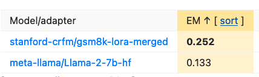
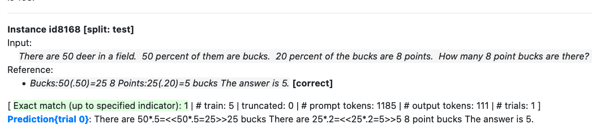

# LoRA: GSM8K on Llama-2 7b

!!! warning

    This tutorial has been superseded by Levanter now supporting chat and supervised datasets directly in the main
    entry points. See the [Training Data Guide](./guides/Training-Data-Guide.md) for more information.

In the [Fine-Tuning tutorial](./Fine-Tuning.md), we demonstrated how to replicate Alpaca using Levanter with either the Llama 1 or Llama 2 models.
The Alpaca methodology is a good way to make a pretty good general-purpose instruction-tuned model, but what
if we want to make a model that's good at a specific task?

In this tutorial, we're going to do that: we're going to use Levanter's implementation of [LoRA](https://arxiv.org/abs/2106.09685) to adapt Llama 2 to
[GSM8K](https://arxiv.org/abs/2110.14168v2), which is a dataset of grade-school math problems.
To evaluate the model, we'll use [CRFM's HELM](https://crfm.stanford.edu/helm/) tool, comparing it to the baseline Llama 2 model.
This tutorial aims to demonstrate the use of LoRA with Levanter, rather than achieving state-of-the-art performance on GSM8K.

LoRA (for Low-Rank Adaptation) is a form of parameter-efficient fine-tuning (PEFT), which is a class of techniques for
adapting models to new tasks without having to store a new copy of the entire model.
LoRA functions by augmenting each linear layer in the model (or a selected subset) with an additional low-rank linear layer.
Training then only updates the parameters of the low-rank layer, leaving the parameters of the base model fixed.
LoRA's main strengths are its memory efficiency and associated on-disk efficiency. LoRA works
on much smaller (and fewer) GPUs than you need for full fine-tuning, and it results in adapters that are only a
few megabytes on disk, rather than the many gigabytes that you would need for a full fine-tuning checkpoint.

We should mention that Hugging Face has a library also named [PEFT](https://github.com/huggingface/peft), which implements a variety of
PEFT techniques, including LoRA. We'll be careful to distinguish between Hugging Face's PEFT library and the general
class of PEFT techniques. The LoRA model we create with Levanter will be compatible with HF PEFT, so that you can use it
with their inference scripts or anywhere else you might want to use an HF PEFT model. Levanter also supports saving
"merged" checkpoints, which are compatible with Hugging Face's Transformers library without HF PEFT.
We'll show you how to do that as well.

## The GSM8K Dataset

Let's talk a little bit about the data. GSM8K is a dataset of grade-school math problems, with the goal of
evaluating models' ability to do arithmetic. Only recently (Claude, GPT-4, Gemini) have LLMs been able to perform
well on this dataset "out of the box." Llama 2 7B only gets 13.3%. Let's see if we can do better!

Here's an example problem from the dataset. (You can see the whole thing on the [Hugging Face Datasets page](https://huggingface.co/datasets/gsm8k/viewer/main/train?row=0))

```
Q: Natalia sold clips to 48 of her friends in April, and then she sold half as many clips in May. How many clips did Natalia sell altogether in April and May?
A: Natalia sold 48/2 = <<48/2=24>>24 clips in May. Natalia sold 48+24 = <<48+24=72>>72 clips altogether in April and May. #### 72
```

You are only actually evaluated on the numerical answer, which comes after the `####`. The explanations
exist to encourage the LLM to do Chain-Of-Thought-type reasoning, rather than trying to do it all "in its head."

## Training a LoRA Model Adapter

We're going to use Levanter to train a LoRA adapter using the same Llama 2 7b model we used in the
[Fine-Tuning tutorial](./Fine-Tuning.md). The full script is available at [`gsm8k_lora.py`](https://github.com/stanford-crfm/levanter/blob/main/examples/gsm8k-lora/gsm8k_lora.py).
Broadly speaking, the script is similar to the fine-tuning script we used for Alpaca, with the key differences being
LoRA-izing the model and changing the data loader for the GSM8K dataset. We will highlight the important parts of the script below.

### 0. Quick LoRA Overview

There are now many tutorials on what LoRA is and how it works, so we won't go into too much detail here.
The basic idea is that we want to adapt a model to a new task, but we don't want to create and store a new copy of the
entire model.

So instead, we add a small number of parameters (typically between .1% and 1%) to the model, and train
just those parameters. The particular way we do this is by adding a low-rank linear layer to each linear layer in the
model (or a subset thereof). That is, we modify each linear layer's weights $W$ to be $W + AB$, where $A$ and $B$
are small matrices. The matrix product $AB$ is low rank (typically rank $r = 8$ or $16$). That is,
if $W \in \mathbb{R}^{m \times n}$, then $A \in \mathbb{R}^{m \times r}$ and $B \in \mathbb{R}^{r \times n}$.
The output of the modified layer is then $(W + AB)x = A(Bx) + Wx$, where $x$ is the input to the layer.
We train only the parameters $A$ and $B$, and leave the parameters $W$ fixed.

This is a diagram taken from [the LoRA paper](https://arxiv.org/abs/2106.09685), which graphically shows how the LoRA transform is applied to a linear layer:


Because the low-rank matrix is small, it's much more space efficient than the "full finetuning" that we did for Alpaca.
For example, in this tutorial with default settings, the LoRA adapter will have about 20M parameters, compared to the
more than 6.7B parameters in the base model, for a reduction of about 99.7%.

This parameter savings also means that training requires much less memory: we can fit
LoRA finetuning onto a much smaller GPU than we could fit full finetuning, because we don't need to store optimizer
states for the base model parameters, and the model parameters themselves can be stored at reduced (compute) precision.
For example, full fine-tuning a 7B model would typically require 80GB just to store the model and optimizer states
(at full precision), but with LoRA we can easily fit training onto a single 40GB A100.

### 1. Apply the LoRA transform to the model

So, to "LoRA-ize" a model, we need to do some surgery on the model's linear layers.
Levanter's `loraize` function replaces each linear layer in the model with a LoRA layer,
which applies the LoRA transform to the linear layer.

`loraize` takes a model and a `LoraConfig` and returns a new model with the LoRA transform
applied to the linear layers. The `LoraConfig` is a dataclass with the following fields:

```python
@dataclass(frozen=True)
class LoraConfig:
    target_modules: Optional[list[str]| str] = None
    """modules to loraize. can either be a regex or a list of strings of module names, or None, meaning all linear modules"""
    r: int = 8  # rank of LoRA transform
    alpha: float = 8.0  # scaling factor for LoRA transform
    dropout: float = 0.0  # dropout probability for LoRA layers
```

By default, we LoRA-ize all linear modules in the model, which we recommend. This was found to be better than the other
options: [\[1\]](https://twitter.com/Tim_Dettmers/status/1689375417189412864), [\[2\] Section 4](https://arxiv.org/pdf/2305.14314.pdf). If you wanted something more targeted, you can use `target_modules`.
`target_modules` is usually specified as a regex which is matched against the module's "path" from the root of the model.
For example, if you wanted to LoRA-ize only the attention layers of our GPT2 implementation, you could do `target_modules=".*\.attn\..*"`.
(In Levanter, these settings can be adjusted either in the config file or through command line flags, as detailed in our [Configuration Guide](./reference/Configuration.md))

In our script below, we apply `loraize` inside of a [`haliax.named_jit`](https://haliax.readthedocs.io/en/latest/partitioning/#haliax.named_jit) function. This ensures that the
parameters are sharded correctly, if you're using more than one device.

```python
@dataclass
class TrainArgs:
    lora: LoraConfig = LoraConfig()

    # ... some other stuff
    hf_save_path: Optional[str] = None  # Path to save the HuggingFace checkpoint.
    hf_upload: bool|str = False  # Name of the HuggingFace repo to upload to (if any).
    hf_save_steps: int = 1000  # How often to save the HuggingFace checkpoint.

    # should we save merged (i.e. not peft) checkpoints?
    merged_hf_save_path: Optional[str] = None  # path to save merged hf checkpoints
    merged_hf_upload: Optional[str] = None
...

def train(config: TrainArgs):
    ...
    with config.trainer.device_mesh:
        ...

        @hax.named_jit(axis_resources=parameter_axis_mapping, donate_args=(True))
        def loraize_hf_model(model):
            return loraize(model, config.lora, key=lora_key)

        model = loraize_hf_model(model)
```

### 2. Tell the trainer to only train the LoRA params

We want to train the LoRA parameters, but not the base model parameters. To do this, we need to tell the trainer
which parameters to train. The `Trainer` takes an optional `is_trainable` argument, which can filter the parameters
we want to train. `is_trainable` is an [Equinox `filter_spec`](https://docs.kidger.site/equinox/examples/frozen_layer/).
You don't need to worry about the internals, but the gist is that it's a "tree of `bool`s" that has the same
shape as the model's tree, except that instead of arrays there are boolean values for whether or not to train that part
of the model. For LoRA, we want to train the LoRA parameters, but not the base model parameters. We can do this by
using the `lora_trainable_params_filter` function, which takes a model and returns an `is_trainable` `filter_spec`.

```python
def train(config: TrainArgs):
    ...
    with config.trainer.device_mesh:
        ...

        lora_param_filter = lora_trainable_params_filter(model)

        trainer = Trainer(config.trainer, optimizer, is_trainable=lora_param_filter)
```

### 3. Serialize a PEFT-compatible checkpoint

Levanter's LoRA module has a function for saving a HF-PEFT-compatible checkpoint, `levanter.lora.save_peft_pretrained`,
which is analogous to HF PEFT's `model.save_pretrained`.

```python
# Save HF PEFT checkpoints periodically (and at the end of training), which is just the lora weights
if config.hf_save_path is not None:
    full_save_path = os.path.join(config.hf_save_path, trainer.id)
    trainer.add_hook(
        save_peft_checkpoint_callback(
            full_save_path, config.lora, config.model_name_or_path, config.hf_upload
        ),
        every=config.hf_save_steps,
    )
```

### 4. Serialize a merged checkpoint

HELM doesn't (yet) support HF PEFT checkpoints, so we also need to save a merged checkpoint, which is the full model
with the LoRA parameters merged back in. This gives up a lot of the space efficiency benefits of PEFT, but it's
just for evaluation. (This functionality is also useful if you want to use the model with inference servers that don't
support PEFT.)

```python

# Save merged HF checkpoints if requested
if config.merged_hf_save_path is not None:
    full_save_path = os.path.join(config.merged_hf_save_path, trainer.id)
    trainer.add_hook(
        save_merged_hf_checkpoint_callback(full_save_path, converter, config.merged_hf_upload),
        every=config.hf_save_steps,
    )
```

## The Configuration File

Here's the complete configuration file for training the adapter. We're using the same Llama 2 model as in the
[Fine-Tuning tutorial](./Fine-Tuning.md), but we're using a different dataset and a different training script.

```yaml
model_name_or_path: "NousResearch/Llama-2-7b-hf"
data: gsm8k
trainer:
  mp: p=f32,c=bfloat16
  wandb:
    project: "levanter-gsm8k"
    tags: ["gsm8k", "lora", "llama2"]
  num_train_steps: 550  # 64 * 550 = 35200, which is a bit more than 4 epochs
  train_batch_size: 64

  # if using model parallelism, this is useful:
  tensor_parallel_axes: ["mlp", "heads"]
optimizer:
  # values in qlora paper
  learning_rate: 2e-4
  weight_decay: 0.0
  lr_schedule: "constant"
lora:
  # These are the defaults, but just so you can see them
  r: 8  # rank of LoRA transform
  alpha: 8.0  # scaling factor for LoRA transform
  dropout: 0.0  # dropout probability for LoRA layers
```

The default config is available at [`gsm8k-llama2.yaml`](https://github.com/stanford-crfm/levanter/blob/main/examples/gsm8k-lora/gsm8k-llama2.yaml).

## Running Training

### Running on NVIDIA GPU

The example commands below demonstrate how to launch a training job
on a single A100, but it should work for other single node GPU configurations.
Please ensure you've gone through the [GPU installation instructions](Getting-Started-GPU.md) first.
We recommend using Ampere or later GPUs with Levanter, as we make heavy use of bf16 precision, which is only performant
on Ampere and later.

Before running your training bash command, ensure you are in your `levanter` conda environment, you've created a directory for saving checkpoints
during training, you are logged into your wandb account with the following two commands:

```bash
conda activate levanter
cd levanter
wandb login ${YOUR TOKEN HERE}
```

Now you can run the training command. This command saves Levanter checkpoints, an HF PEFT checkpoint, and a merged
checkpoint. We'll upload the merged checkpoint to Hugging Face Hub, so that we can evaluate it with HELM.

```bash
python examples/gsm8k-lora/gsm8k_lora.py \
--config_path examples/gsm8k-lora/gsm8k-llama2.yaml \
--trainer.checkpointer.base_path checkpoints \
--hf_save_path hf-checkpoints \
--merged_hf_save_path merged-checkpoints \
--merged_hf_upload <somewhere>/gsm8k-llama2-merged \
--trainer.per_device_parallelism 2
```

The last flag represents how many examples get processed in parallel on each GPU. This is a tradeoff between
speed and memory usage. The value here is tuned for a single 40GB A100.
If you have different (or more) GPUs, you will want to change it. This will take about 6 hours on a single A100.

You can change `--trainer.checkpointer.base_path`,  `--hf_save_path`, and `--merged_hf_save_path` to your desired model
checkpoint directories. You'll also want to replace the `--merged_hf_upload`
with your own Hugging Face Hub username and repo name. (You can also just remove it if you don't want to upload
the merged checkpoint, though HELM needs it to be on the Hub for now.)

### Running on TPU

Here's how to run the command on a TPU v3-32.  As we typically do, we leave all
the paths specified on the command line, so that you can easily change them. They can be either regular
paths or GCS paths.
As with GPU, please ensure you've gone through the [TPU installation instructions](Getting-Started-TPU-VM.md) first.

```bash
infra/babysit-tpu-vm.sh llama-32 -z us-east1-d -t v3-32 --preemptible -- \
WANDB_API_KEY=${YOUR TOKEN HERE} \
HUGGING_FACE_HUB_TOKEN=${YOUR TOKEN HERE} \
bash levanter/infra/run.sh python \
levanter/examples/gsm8k-lora/gsm8k_lora.py \
--config_path levanter/examples/gsm8k-lora/gsm8k-llama2.yaml \
--trainer.checkpointer.base_path gs://<somewhere>/ckpts \
--data_cache_dir gs://<somewhere>/cache \
--hf_save_path gs://<somewhere>/lora \
--merged_hf_save_path gs://<somewhere>/merged \
--merged_hf_upload <somewhere>/gsm8k-llama2-merged \
```

You'll want to replace the placeholders with your own paths.

## Using the Model

The model should work out-of-the-box as a Hugging Face PEFT model. We can use the (not particularly efficient)
inference algorithms in Transformers/PEFT to generate some answers. First, copy the checkpoint to a local directory:

```bash
gsutil cp -r gs://<somewhere>/lora/<run id>/step-<something> ./gsm8k-lora
```

Then, you can use it like this. This script should work with both PEFT and merged checkpoints. This
is by no means a production-ready inference script, but it's enough to show you how to use the model.
In particular, you probably want to use a dedicated inference server.

```python
import sys
import torch
from transformers import AutoModelForCausalLM, AutoTokenizer
from peft import PeftConfig, PeftModel

peft_model_id = sys.argv[1] if len(sys.argv) > 1 else "./gsm8k-lora"

PROMPT = "Q: {question}\nA: "

def format_prompt(**kwargs):
    return PROMPT.format(**kwargs)

try:
    config = PeftConfig.from_pretrained(peft_model_id)
    model = AutoModelForCausalLM.from_pretrained(config.base_model_name_or_path, device_map="auto")
    model = PeftModel.from_pretrained(model, peft_model_id, device_map="auto")
    tokenizer = AutoTokenizer.from_pretrained(config.base_model_name_or_path)
except:
    model = AutoModelForCausalLM.from_pretrained(peft_model_id, device_map="auto")
    tokenizer = AutoTokenizer.from_pretrained(peft_model_id)

device = torch.device('cuda' if torch.cuda.is_available() else 'cpu')

while True:
    question = input("> ")
    question = format_prompt(question=question)
    inputs = tokenizer(question, return_tensors="pt")
    inputs = inputs.to(device)
    with torch.no_grad():
        outputs = model.generate(**inputs, max_new_tokens=200, do_sample=True, min_new_tokens=1)
        print(tokenizer.batch_decode(outputs.detach().cpu().numpy(), skip_special_tokens=True))
```

Here's an example of the model in action:

```bash
> Natalia sold clips to 48 of her friends in April, and then she sold half as many clips in May. How many clips did Natalia sell altogether in April and May?
Setting `pad_token_id` to `eos_token_id`:2 for open-end generation.
['Q: Natalia sold clips to 48 of her friends in April, and then she sold half as many clips in May. How many clips did Natalia sell altogether in April and May?\nA: 48/2 = <<48/2=24>>24 clips were sold in May. 48+24 = <<48+24=72>>72 clips were sold altogether. The answer is 72.\n']
```

## Evaluating the Model with HELM

As promised, we're going to use HELM to evaluate the model. HELM makes it easy to evaluate models on the
(many) benchmarks that the HELM team has added to the system. It also makes it easy to compare models to each other,
and to see individual results for error analysis.

### 1. Install HELM

We recommend installing HELM in a separate virtual environment or conda environment, to minimize the chance of
dependency conflicts. See the [HELM installation instructions](https://crfm-helm.readthedocs.io/en/latest/installation/)
for more details.

```bash
virtualenv -p python3.8 helm
source helm/bin/activate
pip install crfm-helm
```

The rest of this section follows the [HELM tutorial](https://crfm-helm.readthedocs.io/en/latest/tutorial/).

### 2. Evaluate the model

Run this command to evaluate the model on the GSM8K benchmark:

```bash
export MYMODEL="<somewhere>/gsm8k-llama2-merged"
helm-run --run-specs gsm:model=$MYMODEL --enable-huggingface-models $MYMODEL --suite v1 --max-eval-instances 1000
```

If you want to also evaluate the baseline Llama 2 model, you can do that by replacing `$MYMODEL` with
`NousResearch/Llama-2-7b-hf`:

```bash
export MYMODEL="NousResearch/Llama-2-7b-hf"
helm-run --run-specs gsm:model=$MYMODEL --enable-huggingface-models $MYMODEL --suite v1 --max-eval-instances 1000
```

This will take a while.

### 3. Summarize and view the results

These commands will summarize the results and then start a webserver to view them:

```bash
helm-summarize --suite v1
helm-server --suite v1
```

Then, you can go to `http://0.0.0.0:8000/?group=gsm` to see the results. That will show a table of the results like this:



From the table, we can see that the LoRA model is much better than the baseline Llama 2 model, almost doubling the accuracy (from 0.133 to 0.252)!
If you compare it to [the official HELM results](https://crfm.stanford.edu/helm/latest/#/groups/gsm), you'll see that
it's a bit better than Llama 13B, which is pretty good for a first try!

You can also look at the individual results with the HELM UI. If you click through to the individual results for a model,
you can see the model's predictions and the reference answers:




## Conclusion

In summary, this tutorial has walked you through the process of using LoRA (Low-Rank Adaptation) to adapt the Llama 2
model to the GSM8K dataset. We covered how to use Levanter to construct a LoRA model adapter, how to train the adapter,
how to export the adapter to a Hugging Face checkpoint, and how to evaluate the adapter with HELM.

We hope that this tutorial has been helpful. If you have any questions or feedback, please feel free to reach out to us
on [Discord](https://discord.gg/kEj7rj5mA8), [GitHub](https://github.com/stanford-crfm/levanter) or [Twitter/X](https://twitter.com/dlwh).
