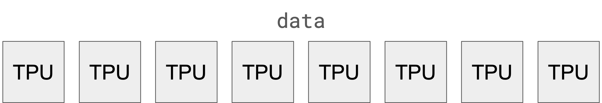
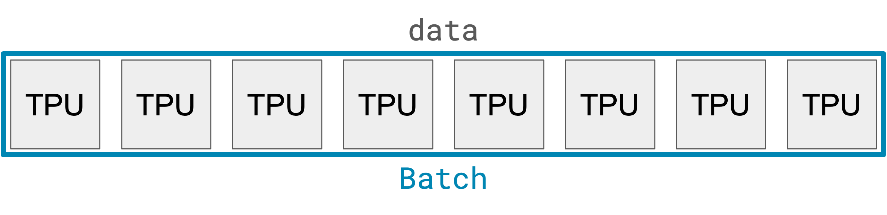
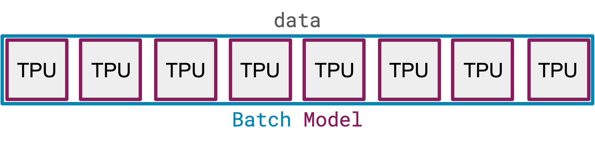

# Levanter

This is a detailed introduction to the Levanter project, including the motivation, design, and implementation.

## Motivation

Levanter started as an effort to understand how to effectively use TPUs. Google kindly offered us at [Stanford's Center
for Research on Foundation Models](https://crfm.stanford.edu) access to a significant amount of TPU compute. Stanford
graduate students, like most graduate students in AI, are big fans of PyTorch. We found that PyTorch on TPUs is still
in its infancy, while Jax support for TPUs is much more mature. We wanted to understand how to use Jax on TPUs, and
how to train large foundation models.

Levanter thus has had a pedagogical mission from the beginning: to provide a simple, easy-to-understand, and easy-to-use
Jax-based framework for training models on TPU clusters (and GPUs!). We hope that this will help others to understand
how to build large models. One of the challenges we had while building models is that a lot of knowledge of how to train
large models is either held in confidence within large companies, or not well-documented, or documented via Twitter
threads and stray comments deep in open source repositories. We hope that Levanter will help to fill this gap.

## Building Blocks

Before we get into the details of Levanter, let's first discuss some of the key building blocks that Levanter is built on.

### Jax: Autodiff

I'm not going to go into great depth on Jax basics, because you can check out the
[official Jax tutorial](https://jax.readthedocs.io/en/latest/jax-101/index.html). But to summarize, Jax is basically a
stateless, jit-optimizing version of numpy with automatic differentiation and distributed GPU/TPU support built in. It's
more than that, but those are the key features in my opinion. I will do a quick refresher on a few concepts.

#### vmap: Automatically adding batch axes
`vmap` is the "auto-batching" operator for Jax. It automatically vectorizes a computation so that it is applied to all
sub-arrays for some new leading axis:

```python
import jax
import jax.numpy as jnp

def foo(a, b): return a @ b

a = jnp.ones((2, 3))
b = jnp.ones((3, 4))
foo(a, b) # 2x3 @ 3x4 = 2x4

batched_foo = jax.vmap(foo)
a = jnp.ones((8, 2, 3))
b = jnp.ones((8, 3, 4))
batched_foo(a, b) # 8x2x3 @ 8x3x4 = 8x2x4
```

#### scan: JIT-friendly for-loop

`scan` is a Jax primitive that allows you to write a for-loop in a functional style. For example, let's say you want
to compute the "cumulative sum" of an array. You could do this with a for-loop:

```python
def cumsum(arr):
    out = []
    for i in range(len(arr)):
        out.append(sum(arr[:i]))
    return out
```

But this is not JIT-compileable. Instead, you can use `scan`:
```python
import jax
def cumsum(arr):
    def body(carry, x):
        return carry + x, carry + x
    return jax.lax.scan(body, 0, arr)[1]
```

Scan returns both the final result of the scan and the intermediate results. In this case, we only care about the
intermediates results, so we index into the tuple with `[1]`. In Haliax we have `haliax.reduce` which is a wrapper
around `scan` that makes it easier to use and works with the NamedAxes system. Levanter also has a `reduce` function
that doesn't know about names, if you want to use it with plain Jax.

#### PyTrees

Structured computation in Jax is achieved via `PyTree`s, which is mostly just a fancy way of saying that many Jax methods
recursively apply themselves to nested data structures. By default, this includes lists, tuples, and dicts. When using
Equinox, Modules are also available as PyTrees and work in a mostly expected way. Jax has methods for flattening and
unflattening PyTrees, as well as `tree_map`, which applies a function to every leaf in a PyTree. For example:

```python
import jax
import jax.numpy as jnp

def foo(a, b): return a @ b

a = jnp.ones((2, 3))
b = jnp.ones((3, 4))
foo(a, b) # 2x3 @ 3x4 = 2x4

jax.tree_util.tree_map(foo, [a] * 5, [b] * 5) # [2x3 @ 3x4] * 5
```

Many methods in Jax are PyTree-aware, though the numpy-like API is usually not. Many methods (though for some
reason not `tree_map`) can operate on "PyTree prefixes", where the first argument is a PyTree and the rest are
prefixes of that PyTree, meaning they have the same structure up to some depth. This is used with `vmap`:

```python
import jax
import jax.numpy as jnp

def foo(args):
    a, b = args
    return a @ b

foo_vmap = jax.vmap(foo, in_axes=((0, 0), )) # vmap over the first axis for both elements of the tuple
foo_vmap2 = jax.vmap(foo, in_axes=0) # the same

a = jnp.ones((8, 2, 3))
b = jnp.ones((8, 3, 4))
foo_vmap((a, b)) # 8x2x3 @ 8x3x4 = 8x2x4
foo_vmap2((a, b)) # 8x2x3 @ 8x3x4 = 8x2x4

# don't map the second part of the tuple
foo_vmap_0 = jax.vmap(foo, in_axes=((0, None),))
```

#### PRNG
Randomness in Jax is carefully controlled: the "state" of a random number generator (called a `PRNGKey` in Jax) has to be passed into every invocation of an RNG or a function that calls an RNG. This adds a lot of ceremony but ensures that your code is always reproducible *and* that it
can be JIT-compiled. That looks like this:

```python
import jax.random as jrandom

key = jrandom.PRNGKey(0)
k1, k2 = jrandom.split(key, 2)

jrandom.normal(k1, (3, 4)) # 3x4 array of random numbers
jrandom.normal(k2, (3, 4)) # 3x4 array of different random numbers
```

#### pjit: distributed computation

`pjit` is the current preferred mechanism for "model parallel" and "tensor parallel" computation, and even data parallel
computation. That basic idea is that you have a "mesh" of devices, typically a 2-d grid, and you can "partition" your computation
across the mesh. The `pjit` operator takes a function and a partitioning specification, and returns a new function that
runs the distributed computation across the mesh. The partitioning specification (often 'PSpec') describes how axes of
the different arrays are partitioned across the mesh.

There's an [official pjit tutorial](https://jax.readthedocs.io/en/latest/jax-101/08-pjit.html), but I honestly don't find it that helpful... We'll do a more detailed look later on.

### Equinox: Low-magic Neural Net Library

[Equinox](https://github.com/patrick-kidger/equinox) is a neural network library for Jax that is somehow simultaneously
both less "magical" than many other neural net libraries for Jax *and* the most PyTorch-like of the bunch. It's built around
a few key ideas, but the one we're most interested in is the `Module` class. A `Module` is just a class that
has been registered with Jax as a PyTree node, which makes all of the Pytree machinery (like tree_map) work for it.
Here's a simple example:

```python
import jax
import equinox as eqx

class MyModule(eqx.Module):
    def __init__(self):
        self.param = jax.random.normal(jax.random.PRNGKey(0), (3, 4))

    def forward(self, x):
        return x @ self.param

class MyModule2(eqx.Module):
    def __init__(self):
        self.param = jax.random.normal(jax.random.PRNGKey(0), (4, 5))
        self.submodule = MyModule()

    def forward(self, x):
        return self.submodule(x) @ self.param
```

There's nothing magic about the `forward` method, or even `__init__`.

### Optax: Optimization

[Optax](https://github.com/deepmind/optax) is a library for optimization in Jax. It's basically a collection of
different gradient transformations that let you do things like gradient clipping, weight decay, and momentum. It
also has bundles of common optimization algorithms like Adam, SGD, and RMSProp. It's a pretty nice library, and
there's not that much to say.

Optimization with Equinox and Optax looks something like:

```python
import optax
import equinox as eqx

model = MyModule2()
opt = optax.adam(1e-3)
opt_state = opt.init(model)

def loss_fn(model, x, y):
    return jnp.mean((model(x) - y) ** 2)

def update(model, opt_state, x, y):
    loss, grads = eqx.filter_value_and_grad(loss_fn)(model, x, y)
    updates, opt_state = opt.update(grads, opt_state, model)
    model = eqx.apply_updates(model, updates)
    return model, opt_state, loss
```

It's so simple that Copilot wrote all that for me... Thanks Copilot!

### Haliax: Named Tensors

Haliax is a library for named tensors in Jax. It wraps Jax's APIs (especially the numpy-like ones, along with
the core transformations like vmap, pjit, etc) to make them work with named tensors. It also builds on top of
Equinox, and adapts many of its conventions for filtering etc.

Haliax is still in development, but it's already pretty usable. Here's a simple example:

```python
from jax.random import PRNGKey
import haliax as hax  # this alias amuses me

Height = hax.Axis('Height', 16)
Width = hax.Axis('Width', 16)
Batch = hax.Axis('Batch', 8)

x = hax.random.normal(PRNGKey(0), (Batch, Height, Width))

# sum out an axis
y = hax.sum(x, Height)

# sum out multiple axes
z = hax.sum(x, (Height, Width))

# broadcasting happens over named axes
normalized_x = x / hax.sum(x, Height)


# vmap over named axes. often times you may want to just skip vmap with haliax, because names are preserved etc,
# but you may still want to use it. I honestly prefer it still, but that's just me.
def foo(x):
    return hax.sum(x, Height)


foo_vmap = hax.vmap(foo, axis=Batch)
```

By convention, we capitalize the names of axes. This is because it makes it easier to visually distinguish them.


#### Why Named Arrays?

I get really confused when reading tensor code that uses axes like `0`, `1`, `2`, etc. It's not clear what
those axes are, and it's especially unclear when you have multiple tensors with different shapes. I've also been
bitten by implicit broadcasting way too many times.

So I found [Alexander Rush](https://rush-nlp.com/)'s [Tensor Considered Harmful](http://nlp.seas.harvard.edu/NamedTensor)
(and [Part 2](http://nlp.seas.harvard.edu/NamedTensor2)) to be very convincing. Named arrays are a way to make this code
more readable, and more robust.

Named Arrays will also make it easier to write partitioned models: jax's `pjit` operator works over "meshes" of devices,
and you partition your parameters and computation along array axes across the mesh. Named arrays make it easier to map
semantically meaningful axes to the mesh axes. (See below for more on this.)

*If you don't want to use NamedArrays for your operations, that's totally fine.* You can still get the benefits of
easier, more semantic-y partitioning if you use NamedArrays as the fields in your Modules, but you can just use `my_array.array`
and access the underlying array and use it like normal.


#### Named Axes in Jax
Jax already has some built-in support for named tensors in the form of [`xmap`](https://jax.readthedocs.io/en/latest/notebooks/xmap_tutorial.html), which uses something like `vmap`/auto-batching to implement tensors that have both positional and named axes.
I was super excited about `xmap` when I first heard about it, but 1) they seem to be deprioritizing it in favor of `pjit`
and 2) ultimately `xmap` can be confusing because you write non-named code for positional axes, then add names "outside"
of the main model code itself. I think it's ultimately harder to reason about than named tensors that are fully integrated,
and it makes it harder to play with different partitioning strategies.

XXX Flax names

#### Named Tensors Elsewhere

Haliax's NamedArrays are probably most similar to [Mesh-Tensorflow](https://github.com/tensorflow/mesh), and I think
I basically reimplemented it in Jax without really meaning to.

PyTorch has [Named Tensors](https://pytorch.org/docs/stable/named_tensor.html). They're purely for documentation purposes
as far as I'm aware, and don't help with model partitioning.

## GPT-2 Implementation

You can skip this part if you're familiar with the basics of how Transformers are implemented. You might want to skim at
least the attention section to see how Haliax is used.

The whole implementation is [here](../src/levanter/models/gpt2.py).
(If you look at the whole thing, I caution you to skip over the torch serialization compatibility parts because they're
messy and not that interesting for our purposes here.) I'll walk through the more interesting bits. In terms of basic
structure and grouping of classes it's pretty similar to standard PyTorch implementations.

If you want, you can compare it with Andrej Karpathy's [minGPT implementation](https://github.com/karpathy/minGPT/blob/master/mingpt/model.py).
Ours is a bit longer (even excluding the torch serialization parts) for a few reasons:
* Boilerplate from declaring fields for modules
* More type annotations
* Tricks to improve stability from the [Mistral project](https://crfm.stanford.edu/2021/08/26/mistral.html#eureka/)


### Attention
Let's jump right into the attention module, starting with the preamble

```python
import haliax as hax
from haliax import Axis, NamedArray
import equinox as eqx
import haliax.nn as hnn

class Gpt2Attention(eqx.Module):
    c_attn: hnn.Linear  # input projection from [embed] -> [(q, k, v), heads, head_dim]
    c_proj: hnn.Linear  # output projection from [heads, head_dim] -> [embed]
    dropout: hnn.Dropout

    causal: bool = eqx.static_field()
    SeqLen: Axis = eqx.static_field()
    HeadDim: Axis = eqx.static_field()
    Heads: Axis = eqx.static_field()
    Qkv: Axis = eqx.static_field()

    # Mistral stability tweaks
    scale_by_inverse_layer_idx: bool = eqx.static_field()
    upcast: bool = eqx.static_field()
```

- The `static_field` decorator is a way to declare fields that are static, and don't change during training. (They're also
not parameters, so they don't get updated during training.)
- `causal` means that this is a causal attention layer, which means that the queries can only attend to the past.

Here's the `__init__` method. It's just initializing the parameters and setting the static fields, but it illustrates
some Jax/Haliax idioms.

```python
    def __init__(
        self,
        SeqLen: Axis,
        InDim: Axis,
        Heads: Axis,
        HeadDim: Axis,
        dropout_prob: float,
        scale_by_inverse_layer_idx: bool,
        upcast: bool,
        *,
        key,
        causal: bool = True,
    ):
        self.Heads = Heads
        self.HeadDim = HeadDim
        self.SeqLen = SeqLen
        self.Qkv = Axis("qkv", 3)
        self.KeySeqLen = SeqLen.alias("key_" + SeqLen.name)

        k_c, k_proj = jrandom.split(key, 2)  # splitting random keys is how you get different random numbers from different calls
        # Haliax's Linear allows you to specify multiple input and output axes, and it will do the right thing
        # I find this clearer than the reshape heavy code you usually see
        self.c_attn = hnn.Linear(In=InDim, Out=(self.Qkv, self.Heads, self.HeadDim), key=k_c)
        self.c_proj = hnn.Linear(In=(self.Heads, self.HeadDim), Out=InDim, key=k_proj)
        self.dropout = hnn.Dropout(dropout_prob)

        self.causal = causal
        self.scale_by_inverse_layer_idx = scale_by_inverse_layer_idx
        self.upcast = upcast
```

The basic flow of multi-headed attention in a standard transformer is (note that the `Batch` axis is omitted for simplicity):
1. For each position, project the input embedding into `Heads` heads, each of which with a query, key, and value vector of dim `HeadDim`. This yields three tensors of shape `[SeqLen, Heads, HeadDim]`.
2. Compute the attention scores for each `(head, position_in_query, position_in_key)`.  This yields a tensor of shape `[SeqLen, Heads, SeqLen]`.
3. Normalize the attention scores to get the attention weights. This yields a tensor of shape `[SeqLen, Heads, SeqLen]`.
4. Compute the attention output for each `(head, position)` by summing up the value vectors, weighting them by the attention weights. This yields a tensor of shape `[SeqLen, Heads, HeadDim]`.
5. Project the attention output back to the embedding dimension. This yields a tensor of shape `[SeqLen, Embed]`.

Let's see how this looks in Haliax:

```python
def __call__(self, hidden_states: NamedArray, layer_idx, inference: bool = True, *, key):
    # 1. Project the input to [seqlen, heads, head_dim]
    qkv_out = self.c_attn(hidden_states)
    q, k, v = qkv_out.unbind(self.Qkv)

    # Rename k and v's SeqLen as haliax doesn't support unnamed axes or duplicate axes
    k = k.rename({self.SeqLen: self.KeySeqLen})
    v = v.rename({self.SeqLen: self.KeySeqLen})

    # mistral tweak: scale norms by 1/layer_idx to prevent blowup
    scale = jax.lax.rsqrt(float(self.HeadDim.size))
    if self.scale_by_inverse_layer_idx:
        scale /= layer_idx + 1.0

    # do this first to help keep FP values small. Papers usually show this after the dot product.
    q = q * scale

    # mistral tweak: attention scores can overflow float16, or just be too imprecise, so upcast to float32
    if self.upcast:
        q = q.astype(jnp.float32)
        k = k.astype(jnp.float32)

    # 2. compute attention scores [batch, heads, seq_len, key_seq_len]
    attn_scores = hax.dot(self.HeadDim, q, k)

    if self.causal:
        causal_mask = hax.tril(hax.ones((self.SeqLen, self.KeySeqLen), dtype=bool), self.SeqLen, self.KeySeqLen)
        attn_scores = hax.where(causal_mask, attn_scores, -1e9)

    # 3. normalize attention scores to "attention weights"
    attn_weights = hnn.softmax(attn_scores, axis=self.KeySeqLen).astype(hidden_states.dtype)
    attn_weights = self.dropout(attn_weights, key=key, inference=inference)

    # 4. compute attention output by summing up the values weighted by the attention scores
    attn_output = hax.dot(self.KeySeqLen, attn_weights, v)  # [heads, seq_len, head_dim]

    # 5. project the attention output back to the original input dimension
    attn_output = self.c_proj(attn_output)
    return attn_output
```

If you're not used to the `tril`-as-a-mask trick, it's a way to create a causal mask so that the attention scores
for a query can only attend to the past. The `tril` function creates a lower triangular matrix. It's equivalent to:
```python
causal_mask = jnp.zeros((seq_len, key_seq_len))
for i in range(seq_len):
    for j in range(key_seq_len):
        if j <= i:
            causal_mask = causal_mask.at[i, j].set(1)
```

### The MLP

The MLP is not terribly interesting. It's just a linear layer followed by a GELU activation, followed by another linear layer.

```python
class Gpt2Mlp(eqx.Module):
    act: Callable = eqx.static_field()
    c_fc: hnn.Linear  # projection from Embed to Intermediate (typically 4x Embed)
    c_proj: hnn.Linear  # projection from Intermediate to Embed

    def __init__(self, Embed: Axis, Intermediate: Axis, activation_fn, *, key):
        k_fc, k_proj = jrandom.split(key, 2)
        self.c_fc = hnn.Linear(Out=Intermediate, In=Embed, key=k_fc)
        self.c_proj = hnn.Linear(Out=Embed, In=Intermediate, key=k_proj)
        self.act = ACT2FN[activation_fn]  # type: ignore

    def __call__(self, hidden_states: NamedArray):
        hidden_states = self.c_fc(hidden_states)
        hidden_states = jax.tree_util.tree_map(self.act, hidden_states)
        hidden_states = self.c_proj(hidden_states)
        return hidden_states
```

### The Block

The block is the basic unit of the transformer. It's just a multi-headed attention layer, followed by a layer norm, followed by an MLP, followed by another layer norm.

```python
class Gpt2Block(TorchSerializationMixin, eqx.Module):
    ln_1: hnn.LayerNorm
    attn: Gpt2Attention
    ln_2: hnn.LayerNorm
    mlp: Gpt2Mlp
    resid_dropout: hnn.Dropout

    def __init__(self, config: Gpt2Config, *, key):
        # skipping this because it's boring
        ...

    def __call__(self, hidden_states: NamedArray, inference, layer_idx, *, key):
        k1, k2, k3 = haliax.jax_utils.maybe_rng_split(key, 3)

        attn_output = self.attn(self.ln_1(hidden_states), inference=inference, layer_idx=layer_idx, key=k1)
        attn_output = self.resid_dropout(attn_output, key=k2, inference=inference)
        hidden_states = hidden_states + attn_output

        ff_output = self.mlp(self.ln_2(hidden_states))
        ff_output = self.resid_dropout(ff_output, key=k3, inference=inference)
        hidden_states = hidden_states + ff_output

        return hidden_states
```

Probably the least understandable thing here is the `maybe_rng_split` function. It's a helper function that
splits the key if it's a JAX PRNG key, and returns a list of None if it's `None`. This is because the `key` argument
is optional, and if it's not provided, we don't want to split the key. This is useful for inference time when we
don't use dropout.

### The Transformer

The transformer conceptually is just a stack of these blocks (plus a final layer norm). In Jax, we can use `jax.vmap` to
create a vectorized block stack, and then use `jax.lax.scan` to apply the blocks in sequence. We use Haliax named
variants of these functions: `hax.vmap` and `hax.fold`. (Jax doesn't have `fold` per se, but instead uses `scan` for both.
Haliax also has a `hax.scan` function that's equivalent to `jax.lax.scan`.)

This can be a bit hard to understand, so let's break it down. First, we create a vectorized block stack:
```python
class Gpt2Transformer(eqx.Module):
    config: Gpt2Config = eqx.static_field()
    blocks: Gpt2Block
    ln_f: hnn.LayerNorm

    @property
    def Layers(self) -> Axis:
        return self.config.Layers

    def __init__(self, config: Gpt2Config, *, key):
        super().__init__()
        self.config = config

        self.blocks = hax.vmap(Gpt2Block, self.Layers)(config, key=shaped_rng_split(key, config.num_layers))
        self.ln_f = hnn.LayerNorm(config.Embed, eps=config.layer_norm_epsilon)
```

Recall that `vmap` inserts a new axis into the function. So, `hax.vmap(Gpt2Block)` creates a function that takes
a "batch" of keys (meaning a key array with a leading axis for the number of layers) and returns a "batch" of blocks
(meaning a single Block object whose arrays have a leading axis for the number of layers).

Next, we create a function that applies the blocks in sequence:

```python
    def __call__(self, hidden_states: NamedArray, inference, *, key) -> NamedArray:
        def do_block(hidden_states, block, layer_idx, key):
            return block(hidden_states, inference=inference, layer_idx=layer_idx, key=key)

        keys = hax.jax_utils.maybe_rng_split(key, self.config.num_layers) if key is not None else None
        hidden_states = hax.fold(do_block, axis=self.Layers)(  # type: ignore
            hidden_states, self.blocks, hax.arange(self.Layers), key=keys  # type: ignore
        )
        hidden_states = self.ln_f(hidden_states)

        return hidden_states
```

If you're not used to functional programming, this might be a bit hard to follow at first. The `fold` function is
equivalent to a `for` loop. It takes a function `do_block` and applies it to each element of the `self.blocks` array,
accumulating the result. The `axis` argument tells it which axis to iterate over. This invocation is equivalent to the
following Python:

```python
hidden_states = hidden_states
for layer_idx, block in enumerate(self.blocks):
    key = keys[layer_idx] if keys is not None else None
    hidden_states = do_block(hidden_states, block, layer_idx, key)
```

The reason to use `fold`/`scan` in Jax is that it makes compilation much faster, and it also works with non-constant
lengths. We're mostly using it for compilation speed. Eventually we'll add support for fancy gradient checkpointing
strategies to Haliax `fold` and `scan`.

## Data Parallel Training via `pjit`

With all that, let's go ahead and implement data parallel training. As a reminder, data parallel training is the
"obvious" way to do distributed training: Jax has a few ways of doing data-parallel distributed training: `pmap`,
`xmap`, and `pjit`. `pjit` is the most flexible one, and it's what we'll be using. However, `pjit` is also the most complicated.

We'll start with the comparatively simple use case of data parallelism, and then graduate up to the more complicated
case of model (activation) parallelism.

### Device Meshes for Data Parallelism

Currently in Jax, the primary abstraction for partitioning data across a device is a "device mesh", which is
basically just an N-dimensional array of devices. Typically, we use 2-dimensional meshes, and the two axes of the
mesh are labeled `data` and `model`. The `data` axis is the one that we'll use for data parallelism, and the `model`
axis is the one we'll use for model parallelism. For now, let's only worry about a one-dimensional mesh, which
is equivalent to a single list of devices, and we'll name its one axis `data`:



To do data parallel training, we basically want to take each batch and split it up along the `data` axis of the mesh.
For a language model, we can think of each batch as a matrix of shape `(Batch, SeqLen)`. Thus, we want to split
the batch dimension into `num_devices` chunks:



The blue box around all the devices shows that we're partitioning the `Batch` dimension of the data matrix across
all devices, so that each device gets `1/num_devices` of the batch.

Our model, on the hand, is replicated across all devices, with one copy of the model on each device.
That looks something like:



The purple box around each device indicates that one copy of the model is on that device.

When we compute the mean of the gradients and the loss, Jax will automatically average them across the devices, and
we'll broadcast the averaged gradients to all devices to do parameter updates. This is the same as the "all-reduce"
operation in PyTorch.

### `pjit` for Data Parallelism

The way we do this sharding in Jax is with `pjit`. `pjit` is a function that takes a function and a `PartitionSpec` for each
input and output and returns a new function that's "partitioned" across the devices in the mesh. The `PartitionSpec` is
just a fancy tuple, and it tells `pjit` how to map each axis of the inputs and output to the devices in the mesh. You
can pass in `None` for an axis if you don't want to partition it, and you can pass in None instead of an entire
`PartitionSpec` if you don't want to partition any axes.

As a simple-ish example, let's do a distributed matrix multiply. We'll suggestively name the variables so you
can see where this is going:

```python
from jax.experimental.pjit import pjit
from jax.experimental.pjit import PartitionSpec
import jax
import jax.numpy as jnp
import numpy as onp

inputs = jnp.ones((128, 64))  # [batch, embed]
weights = jnp.ones((64, 32))  # [embed, hidden]

devices = onp.array(jax.devices())
mesh = Mesh(devices, ("data",))  # devices, axis names

with mesh:
    def matmul(weights, inputs):
        return inputs @ weights


    pjit_matmul = pjit(matmul,
                       in_axis_resources=(None, PartitionSpec("data", None)),
                       out_axis_resources=PartitionSpec("data", None))
    print(pjit_matmul(weights, inputs))
```

This divides up the `inputs` matrix along the `data` axis of the mesh, so that each device gets `128 // num_devices`
rows. It then computes the matrix multiply on each device for its slice of the data, yielding a slice of the result
matrix that has shape `(128 // num_devices, 32)`. These slices are implicitly concatenated along the `data` axis
of the mesh, and the result is a matrix of shape `(128, 32)`. The `PartitionSpec` for the output is the same as
the input, so the output is also partitioned along the `data` axis.

If instead we had specified that the output should not be sharded, then Jax would have automatically broadcast
the result to all devices, and we would have gotten a matrix of shape `(128, 32)`.

### Adding `pjit` to training

Now that we have a basic understanding of how `pjit` works, let's add it to our trainer. We'll start by creating a mesh
with `num_devices` devices, and then we'll add a `with mesh:` block to our training loop. Inside the `with mesh:`
block, we'll add a `pjit` call to our `training_step` function, specifying that the `input_ids` and the keys should be
partitioned along the `data` axis of the mesh, and that the output should not be partitioned. We'll also add a XXX


## Model Parallelism with Activation Sharding

XXX Transition

Activation partitioning is a technique that allows you to split up the activations of a model across multiple devices.
Typically, this is accompanied by model partitioning, which splits up the parameters of the model across multiple devices.
(This is distinct from ZeRO, which also splits up the model parameters and associated states. We'll cover the difference
later.)

Jax has a principle that computation follows data: if you want to do a distributed matrix multiplication, you can split
your matrix up across multiple devices, do the appropriate local matrix multiplications, and then aggregate the results.
As an example, if I have a 1024x512 matrix and I want to do a distributed matrix multiply by a hidden state vector of
dimension 512, I can split the matrix up into 4 256x512 matrices, do 4 local matrix multiplies each against the vector,
and then sum up the resulting 1024 vectors.

This is the principle behind `pjit`, except it's all done automatically under the hood. `pjit` will let us write our model
code as if it were running on a single device, but then we specify how we want our parameters and data to be partitioned
across devices, and `pjit` and the [XLA SPMD partitioner](https://arxiv.org/pdf/2105.04663.pdf) will do the rest.

As a note, there are at least two things people call "model parallelism." The first is activation sharding, which is what
we're going to cover here. The second is pipeline parallelism, which is a technique for splitting a computation into
multiple stages, and then running each stage on a different device. We haven't implemented pipeline parallelism in
Levanter yet, but it's on our roadmap.

### Device Meshes for Model Parallelism

So far, we've only had device meshes with a single axis. Now, let's add a second axis, and call it `model`:


As before we'll use the `data` axis for data parallelism, and the new `model` axis we'll use for model parallelism.

Now, if we map our `Batch` axis to the `data` axis, then our data is replicated two times, so that each row of the
`model` axis gets a copy of the data:


Now let's talk about partitioning our model. Jax partitions things in terms of axes, so we need to choose which
axes of our model we want to partition. Let's focus on just the MLP part of our model for now, and ignore the
attention heads. Our MLP has two Linear modules `c_fc` and `c_proj`. `c_fc` has shape `[Embed, Mlp]`, and
`c_proj` has shape `[Mlp, Embed]`. (There are bias terms but we'll ignore them for now.)

We're going to partition the `Mlp` axis of our model, and leave the `Embed` axis unpartitioned. This means that
each column of our device mesh will get a complete copy of the parameters. The top row will get the first `Mlp/2`
columns of `c_fc`, and the bottom row will get the second `Mlp/2` columns of `c_fc`. (Similarly for `c_proj`.)


What's more, when we do computations with this parameter, Jax will partition the computation and the result for us
in the "right way." For example, when we multiply our `input: [Batch, SeqLen, Embed]` by the matrix parameter
of `c_fc: [Embed, Mlp]` to get a result `intermediate: [Batch, SeqLen, Mlp]`, Jax will automatically partition
the computation and the result so that the `Batch` axis is partitioned along the `data` axis, and the `Mlp` axis
is partitioned along the `model` axis. Thus, the `intermediate` result will be partitioned along both axes, so
that no device shares any data with another device. That looks like this:


When we do the next computation, where we matrix-multiply `intermediate: [Batch, SeqLen, Mlp]` by `c_proj: [Mlp, Embed]`,
Jax will "do the right thing" so that the `Batch` axis is partitioned along the `data` axis, and the `Embed` axis
is replicated, so that the final result `output: [Batch, SeqLen, Embed]` is also partitioned in the same way as the original
`input: [Batch, SeqLen, Embed]`.


### `pjit` for Activation Sharding


Now let's see how to do a similar distributed matrix multiply using `pjit`. `pjit` takes a function and a `PartitionSpec` for each
input (or None to indicate that the input should be fully replicated across the mesh) and for each output,
and returns a function that runs the function after partitioning the data across the mesh (if they need to be).

Here's an example:

```python
from jax.experimental.pjit import pjit
from jax.experimental.pjit import PartitionSpec
import jax
import jax.numpy as jnp
import numpy as onp

inputs = jnp.ones((128, 64))  # [batch, embed]
weights = jnp.ones((64, 512))  # [embed, intermediate]

devices = onp.array(jax.devices())
mesh = Mesh(devices, ("data",))  # devices, axis names

with mesh:
    def matmul(weights, inputs):
        return inputs @ weights


    pjit_matmul = pjit(matmul,
                       in_axis_resources=(PartitionSpec(None, "model"), PartitionSpec("data", None)),
                       out_axis_resources=PartitionSpec("data", "model"))
    print(pjit_matmul(weights, inputs))
```

This will partition the `weights`'s second axis  along the `model` axis, and the `inputs`'s first axis along the `data` axis, and then do a
distributed matrix multiply. The result will be partitioned along both axes, so that no device shares any data with another device.


### Haliax `named_pjit`

`pjit` is great, but it can be a bit of a pain to use when you have a lot of inputs and outputs. For example, if you
have a complex nested model hierarchy (e.g. our GPT-2) it can be difficult to specify the partitioning for each
parameter.

This is where named axes come in. With Haliax, you can specify a "physical" (i.e. mesh) axis name for each
named axis in your model. Then, you just call `named_pjit` with the name of the function you want to partition, and
the `dict` containing those mappings. That's it! Here's that same example from above, but using named axes:
```python
import haliax as hax
from haliax.partitioning import named_pjit
import jax
import numpy as onp

Batch = hax.Axis("batch", 128)
Embed = hax.Axis("embed", 64)
Intermediate = hax.Axis("intermediate", 512)

inputs = hax.ones((Batch, Embed))
weights = hax.ones((Embed, Intermediate))

def matmul(weights, inputs):
    return weights.dot(Embed, inputs)

# assume we have 8 devices, e.g. a v3-8 TPU node
devices = onp.array(jax.devices()).reshape((4, 2))
mesh = Mesh(devices, ("model", "data"))

pjit_matmul = named_pjit(matmul, axis_resources={"intermediate": "model", "batch": "data"})

with mesh:
    print(pjit_matmul(x, y))
```

And you're done! If you want to have different partitioning for inputs and outputs, you can specify those separately:

```python
pjit_matmul = named_pjit(matmul,
                         in_axis_resources={"intermediate": "model", "batch": "data"},
                         out_axis_resources={"batch": "data"})
```

### Model-Partitioned GPT-2 Training

Now that we've covered the basics of `pjit` and our named variant, let's see how we can use it to train a model-parallel
GPT-2 model. XXX


## Reducing Memory Usage

When doing training, you need to store the parameters for your model, the gradients, and the optimizer state. For Adam
and its kin, the optimizer state is another two copies of the parameters. If you store your parameters in float32, you
need at a minimum `16 * num_params` bytes of memory, without including the memory needed for activations. (For LLMs, the
data for a batch is typically trivial in comparison.) If you don't use ZeRO (XXX cite) or some other technique, you'll
need to store all of these on every TPU/GPU. (It's generally recommended to store all of these (maybe not the gradients)
in float32 for training.)

While we'll get to ZeRO/FSDP in a bit, in the meantime we can use mixed precision training to reduce the memory footprint
of the model.

A single v3 or v4 TPU core has 16GB of memory. This means that, for a 345M parameter model, we've already committed
to using 5.5GB of memory for the parameters and optimizer states alone. This is plenty of space, but if we go to
a 750M parameter model, we'll need 12GB of memory. This doesn't give us a ton of room for the activations, which
can be nontrivial.

### Mixed Precision Training via `jmp`

A first easy win is to use mixed precision training. This is a technique where you store the parameters (and optimizer
states) in full precision, but only use half precision (bfloat16) for the activations. This reduces the memory footprint of the
model and optimizer states by a factor of 2: so our 750M parameter model would only need 6GB of memory. This is a
significant win, and it's easy to do with Jax and a library called [`jmp`](https://github.com/deepmind/jmp).

We could just do everything in bfloat16, but there's been lots of reports that, even when stable, keeping everything in bfloat16
can lead to worse performance. For instance, the [Gopher paper](https://arxiv.org/pdf/2112.11446.pdf) found a ~.15 nat
loss increase at 417M parameters, which is consistent with what we found in our experiments. So, we'll keep the
parameters and optimizer states in float32, and use bfloat16 for the activations.

[`jmp`](https://github.com/deepmind/jmp) is a very small library that manages mixed precision. You just make a `Policy`
that lets you specify the underlying dtype for three "semantic" dtypes: parameter, compute, and output. The policy
has methods for convert an array or pytree of arrays to the appropriate dtype, and for converting back to each
of these semantic dtypes.

```python
import jmp
policy = jmp.get_policy("compute=bfloat16,parameter=f32,output=f32")

policy.cast_to_compute(my_model)  # Convert x to bfloat16
```

To plug this into our trainer, we need to make just two changes. First, when we create our model, we cast it to the
param dtype. Next, when we get ready to compute the loss, we cast the model to the compute dtype.

Here's what that looks like:
```python


XXX
```


### ZeRO: Parameter Partitioning

[ZeRO](https://arxiv.org/abs/1910.02054) (short for ZEro-Redundancy Optimizer) is a set of techniques for optimizing large-scale training
by partitioning model parameters, gradient accumulation buffers, and optimizer states across multiple devices, so that no
device has any overlap with any other device in terms of what parameters it stores.

In PyTorch-land, there are two main implementations of ZeRO: DeepSpeed and Fully Sharded Data Parallel (FSDP). These are
complex software libraries that have a lot of moving parts. With Jax, we'll get most of the benefit in a few lines of code.

To get started, let's talk about what ZeRO does. Conceptually, ZeRO assigns each device a slice of the model. The device
holds the parameters, optimizer states, and gradient accumulation buffers for that slice. When computing gradients,
each device has to receive the parameters for the entire model (but just in time), compute the forward and backward
pass, and then scatter the gradients to the relevant devices. Afterwards, each device will update its slice of the
parameters, and then the next batch can be processed.

So we basically have two ways we need to partition the model: once for "compute" and once for "parameters." "Compute"
is how we've been doing things so far: sharding our model and activations along the `model` axis. For "parameters,"
we want our model to be fully sharded. To do that, we need to partition our model along the `data` axis too. Luckily,
we have one `Axis` that consistently shows up in nearly all of our parameters: `Embed`. So what we're going to do is
partition the `Embed` axis along the `data` axis of our device mesh. This will give us a fully sharded model, modulo a few
bias terms.

Consider a matrix like `c_fc: [Embed, Mlp]`. `c_fc`'s `Mlp` axis is always partitioned across the `model` axis of the
device mesh, for both "compute" and "parameter." For "parameter," the `Embed` axis is also partitioned across the `data` axis of the
device mesh. Schematically, this looks like:


Now, to do our forward pass, we repartition our parameters just-in-time so that each device has the parameters it needs:
we go from the parameter partitioning to the compute partitioning. We then do our forward pass. During the backward pass,
we repartition our gradients from the compute partitioning to the parameter partitioning. We then do our backward pass,
accumulating the gradients into the gradient accumulation buffers that are also partitioned along the `data` axis. Finally,
we do our gradient updates, and then we're ready for the next batch.

In Haliax, that looks like this:

XXX

### Other Techniques
#### Gradient Checkpointing

#### Argument Donation


## Random Gotchas
### Pjit's SPMD partitioner gets confused
Sometimes Jax doesn't shard things the way you want, and this can lead to either huge slow downs or huge memory consumption. Jax's `with_sharding_constraint` or Haliax's `auto_sharded` is your friend here.

### Randomness isn't shardable
Unfortunately, random number generation in Jax is sequential: there's no way to "fast-forward" the RNG. Let's say I want to generate a 4096 x 8192 matrix that is sharded along the first axis across 4 nodes. Then, I might want to write something like this:

```python
import jax
from jax.experimental.pjit import pjit
from jax.random import PRNGKey
key = PRNGKey(0)

def make_matrix(key): return jax.random.normal(key, (4096, 8192))

make_matrix = pjit(make_matrix, in_axis_resources=(None,), out_axis_resources=("model", None))

my_matrix = make_matrix(key)
```

Unfortunately what Jax does here is generate all 4096 \* 8192 = 33,554,432 entries on every node, and then select the appropriate range. That is, it might look something like this:

```python
# on node 0:
whole_matrix = jax.random.normal(key, (4096, 8192))
my_shard = whole_matrix[4096/4 * 0: 4096/4 * 1, :]
# on node 1:
whole_matrix = jax.random.normal(key, (4096, 8192))
my_shard = whole_matrix[4096/4 * 1: 4096/4 * 2, :]
# etc.
```

This is pretty expensive and, more importantly, ends up using a whole lot of precious TPU RAM, to the extent that I've had models that should fit in RAM run out of memory during initialization.

A somewhat ugly way to work around this is to use the "split" property of  something a bit less attractive like:
```python
key = PRNGKey(0)

vmap_normal = jax.vmap(lambda k: jax.random.normal(k, 8192))
my_matrix = vmap_normal(jax.random.split(key, 4096))

def make_matrix(key): return jax.random.normal(key, (4096, 8192))
```
**This changes the result from the "naive" version**, but as long as you're consistent, It's fine.


XXX when we do Haliax's new partitioning, we should show that

Haliax actually automatically does this under the hood along the biggest partitioned axis:

```python
import haliax as hax

Hidden = hax.Axis("Hidden", 4096)
Mlp = hax.Axis("Mlp", 8192)

key = PRNGKey(0)
my_matrix = hax.random.normal(key, (Hidden, Mlp))
```

**Note that this means that random number generation changes if you change the partitioning**, which isn't ideal, but it sometimes makes things work that didn't work before.
