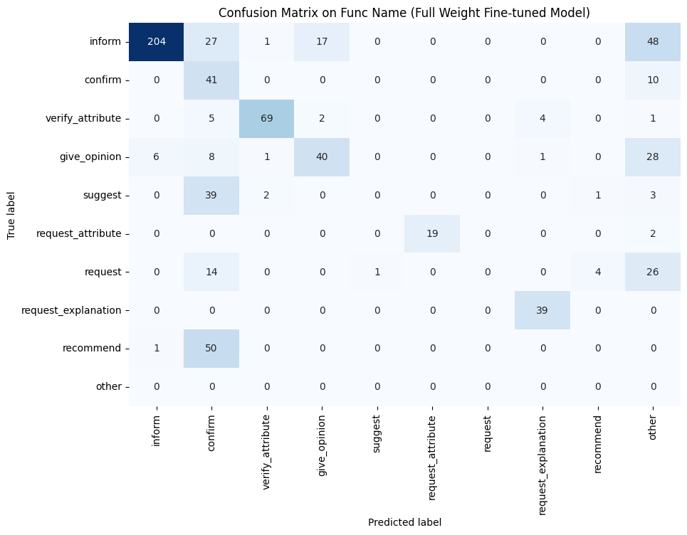

# Fine-Tuning for Semantic Parsing

Semantic parsing is a process that transforms a natural language sentence into a logical form.
This logical form represents the sentence's meaning in a way that computer programs can utilize to carry out tasks, respond to questions, or follow commands.

For example, through semantic parsing, a chatbot can convert a question posed in natural language into a precise SQL query, which then retrieves the desired information from a database.
Similarly, a virtual assistant can interpret a user's spoken request and, by employing semantic parsing, translate it into a JSON object that triggers specific actions.
By bridging the gap between human language and machine-readable formats, semantic parsing empowers AI systems to perform tasks with both accuracy and autonomy.

In this post, we'll guide you through fine-tuning a [Llama2 model](https://ai.meta.com/llama/) for semantic parsing with Levanter.

## Example Task
Our example task is based on the [GEM ViGGO](https://huggingface.co/datasets/GEM/viggo) dataset.

It translates conversational English queries on the topic of video games into a structural format.
Each example features a plain English input and a structured output that adheres to predefined rules for function naming conventions and attributes.

The dataset has 5,103 training examples and 714 examples for evaluation.
Although smaller than [the Alpaca dataset](../Fine-Tuning.md#overview-of-alpaca), it provides a decent amount of data to effectively adapt the model to the task.

Below are some examples from the dataset:

In this example below, the user expresses an opinion on a game and describes the game with a list of attributes.
The chatbot should capture the intention (`give_opinion`), as well as the attributes that describe the game (name, release year, rating, has_multiplayer).

```
Query: I had fun playing Age of Empires II: The Age of Kings. I enjoy a lot of multiplayer games from 1999.
Expected Response: give_opinion(name[Age of Empires II: The Age of Kings], release_year[1999], rating[good], has_multiplayer[yes])
```

In this example below, the query describes a game in a very detailed manner.
The chatbot should tell apart the intention of `inform` from `give_opinion` in the example above, and parse all the corresponding attributes. It is a typical example of "Semantic Parsing" and it is not easy to capture all the attributes with field and value correctly.

```
Query: BioShock is a good role-playing, action-adventure, shooter that released for PlayStation, Xbox, and PC in 2007. It is available on Steam, and it has a Mac release but not a Linux release.
Expected Response: inform(name[BioShock], release_year[2007], rating[good], genres[action-adventure, role-playing, shooter], platforms[PlayStation, Xbox, PC], available_on_steam[yes], has_linux_release[no], has_mac_release[yes])
```

This is an example of a user asking for an action. The chatbot should capture the intention and attributes correctly, so that it can generate a backend call to perform the action.

```
Query: Is it the PC game, The Elder Scrolls Online, which was developed by ZeniMax Online Studios?
Expected Response: confirm(name[The Elder Scrolls Online], developer[ZeniMax Online Studios], platforms[PC])
```

### Quick Test with Llama2-7B Chat Model

If we test with the Llama2-7B chat model on these examples (see the full prompt in [Appendix A](#appendix-a-the-prompt-used-in-this-task)),
we can see it does not learn the task well: it struggles to generate the correct function names and hallucinates quite a few attributes that are not mentioned in the query; it also produces outputs with incorrect formats (`\n` before attribute names, `[E (`, etc).

```
Query:  I had fun playing Age of Empires II: The Age of Kings. I enjoy a lot of multiplayer games from 1999.
Target: give_opinion(name[Age of Empires II: The Age of Kings], release_year[1999], rating[good], has_multiplayer[yes])
Model:  inform(name[Age of Empires II: The Age of Kings], release_year[1999], esrb[E (for Everyone)], genres[strategy], platforms[PC], has_multiplayer[yes])

Query:  BioShock is a good role-playing, action-adventure, shooter that released for PlayStation, Xbox, and PC in 2007. It is available on Steam, and it has a Mac release but not a Linux release.
Target: inform(name[BioShock], release_year[2007], rating[good], genres[action-adventure, role-playing, shooter], platforms[PlayStation, Xbox, PC], available_on_steam[yes], has_linux_release[no], has_mac_release[yes])
Model:  inform(name[BioShock], release_year[2007], esrb[Rating Pending], genres[role-playing, action-adventure, shooter], platforms[PlayStation, Xbox, PC], available_on_steam[yes], has_mac_release[yes], has_linux_release[no])

Query:  Is it the PC game, The Elder Scrolls Online, which was developed by ZeniMax Online Studios?
Target: confirm(name[The Elder Scrolls Online], developer[ZeniMax Online Studios], platforms[PC])
Model:  inform(name[The Elder Scrolls Online], release_year[2014],\nesrb[M (for Mature)], genres[action, adventure, role-playing],\nplatforms[PC], available_on_steam[yes], has_linux_release[no],\nhas_mac_release[yes])
```

This highlights the need for fine-tuning: to enhance the model's understanding on this task and producing the intended output.

## Fine-tuning with Levanter

### Step 1: Prepare the Dataset

Let's begin by preparing the dataset.

Since our dataset is already in a clean, tabular format, minimal preprocessing effort is required.
Our main tasks are to rename the columns and convert the data into the JSONL format, which is compatible with Levanter.
For detailed instructions, refer to the documentation [Training on Your Data](../Training-On-Your-Data.md#data-preparation).

Below is a code snippet for dataset preparation:

```python
import json
import datasets


# load the dataset
train_dataset = datasets.load_dataset("GEM/viggo", split="train")

# rename the columns
train_dataset = train_dataset.map(
    lambda example: {
        "instruction_field": PROMPT,
        "input": example["target"],
        "output": example["meaning_representation"],
    }
)

# save the dataset in JSONL format
with open("train.jsonl", "w") as f:
    for example in train_dataset:
        json.dump(example, f)
        f.write("\n")
```

The `PROMPT` provides the model with instructions to enhance its understanding of the task at hand.
In our example, the prompt details the potential function names and attributes, aiding the model in generating the correct output.
We provide the full prompt in [Appendix A](#appendix-a-the-prompt-used-in-this-task).
While helpful, including a prompt is optional for fine-tuning.

### Step 2: Fine-tune the Model

Now, let's proceed to fine-tune the model with Levanter.

For this example, we've explored both comprehensive full-weight fine-tuning, similar to the approach used in Alpaca, and the more resource-efficient LoRA fine-tuning. Detailed descriptions of both methods are available in the documentation: [Fine-Tuning](../Fine-Tuning.md) and [LoRA](../LoRA.md).

Here's a brief comparison of the two:

- **Full-weight fine-tuning**: it fine-tunes the entire model weights to better follow the instruction and examples in the training dataset. It is able to leverage the entire  model capacity, but it is expensive and prone to overfitting.
- **LoRA fine-tuning**: it adapts the model to the task by adding a small number of parameters (0.1% to 1%) to the model, and train only those parameters. The new parameters are sufficient to capture the task-specific patterns and enable the model to generate the desired output. After training, we merge the new parameters into the original model to be used for inference. It is much more efficient than full-weight fine-tuning, and it is less prone to overfitting.

Levanter provides good support for both methods. Therefore, we can easily try both methods and compare their results.

#### Full-weight Fine-tuning

We start with full-weight fine-tuning. Below is our configuration. Noteably:

- The base model is `NousResearch/Llama-2-7b-hf`. It is set as the default value, so we don't need to specify it explicitly.
- Batch size: We set the batch size to 128, which is the maximum batch size that can fit into a single TPUv3-8.
- Learning rate: We compared the results with 3 epochs vs 2 epochs, and found that 2 epochs is sufficient to achieve the best results, while 3 epochs leads to overfitting.

```yaml
data: "gs://levanter-data/fine-tuning/gem-viggo/GEM_viggo_train.jsonl"
data_cache_dir: "gs://levanter-data/tokenized/GEM_viggo_llama/"
trainer:
  wandb:
    project: "levanter"
    tags: ["viggo", "llama", "full-weight"]
  mp: p=f32,c=bfloat16
  train_batch_size: 128
  num_train_steps: 80  # 5103 examples / 128 batch size * 2 epochs
  tensor_parallel_axes: ["mlp", "heads"]
optimizer:
  learning_rate: 2E-5
```

The detailed instruction to run the training job can be found in the [Fine-Tuning documentation](../Fine-Tuning.md).
Here is the command to run the training job on TPU:

```bash
gcloud compute tpus tpu-vm ssh finetune-32 --zone us-east1-d --worker=all \
--command="WANDB_API_KEY=${YOUR WANDB TOKEN HERE} \
HUGGING_FACE_HUB_TOKEN=${YOUR HF TOKEN HERE} \
bash levanter/infra/run.sh python \
levanter/examples/alpaca/alpaca.py \
    --config_path gs://<config-yaml-file> \
    --hf_save_path gs://<somewhere>"
```

Given the small dataset and high efficiency of Levanter, the entire training job completed quickly in only 21 min on a single TPUv3-8.

#### LoRA Fine-tuning

Below is our configuration for LoRA fine-tuning. Note that it is very similar to the full-weight fine-tuning configuration, except for a few differences:

- We added the `lora` section to specify the LoRA parameters. All of the parameters are set to the default values.
- We increased the number of steps by 1 more epoch. LoRA fine-tuning uses less parameters, so it regularizes better and we can train for more steps.
- We increased the learning rate to 3e-4, but we did not do very thorough hyperparameter tuning. We expect there might be a better learning rate.
- We found weight decay at 0.1 leads to better results than no weight decay, so we set it at 0.1.

```yaml
data: "gs://levanter-data/fine-tuning/gem-viggo/GEM_viggo_train.jsonl"
data_cache_dir: "gs://levanter-data/tokenized/GEM_viggo_lora/"
trainer:
  wandb:
    project: "levanter"
    tags: ["viggo", "llama", "lora"]

  mp: p=f32,c=bfloat16
  train_batch_size: 128
  num_train_steps: 120  # 5103 examples / 128 batch size * 3 epochs
  tensor_parallel_axes: ["mlp", "heads"]
optimizer:
  learning_rate: 3e-4
  weight_decay: 0.1
lora:
  r: 8  # rank of LoRA transform
  alpha: 8.0  # scaling factor for LoRA transform
  dropout: 0.0  # dropout probability for LoRA layers
```

Here is the command to run the training job on TPU:

```bash
gcloud compute tpus tpu-vm ssh finetune-32 --zone us-east1-d --worker=all \
--command="WANDB_API_KEY=${YOUR WANDB TOKEN HERE} \
HUGGING_FACE_HUB_TOKEN=${YOUR HF TOKEN HERE} \
bash levanter/infra/run.sh python \
levanter/examples/alpaca-lora/alpaca_lora.py \
    --config_path gs://<config-yaml-file> \
    --hf_save_path $GS_BUCKET/llama2/ \
    --merged_hf_save_path gs://levanter-checkpoints/llama2/llama2_7b_viggo_lora"
```

Note that with `--merged_hf_save_path`, it will merge the trained LoRA parameters into the original model and save the new model.
To save the LoRA adaptors as separate weight file, use `--hf_save_path` instead.

## Evaluation

### Metrics
How do we accurately evaluate a model's performance in semantic parsing tasks?
Character-level accuracy falls short as it doesn't account for variations in the order of attributes and does not distinguish between function names and attributes.
Instead, we assess the model's ability to interpret instructions and parse semantic meaning from input queries by measuring more specific accuracies:

- Function Name Accuracy: This metric confirms whether the extracted function name matches the expected one.
- Attribute Set Accuracy: This checks if the model identifies the correct set of attributes, regardless of their order.
- Attribute Value Accuracy: This evaluates the proportion of attributes for which the model has accurately predicted the corresponding values.
- Overall Accuracy: This is the simple average of the three metrics above. This is used as an aggregate metric to compare the overall performance of the model.

Together, these metrics provide a comprehensive picture of the model's effectiveness in this task.

The code snippet below shows how we extract the function name and attributes from the model's response and evaluate each accuracy metric.

```python
def extract_function_and_attributes(response):
    # Remove extra spaces and normalize the response
    response = response.strip().lower()
    # Extract the function name using regex
    function_match = re.match(r"(\w+)\(", response)
    function_name = function_match.group(1) if function_match else None
    # Extract attributes and their values using regex
    attributes = re.findall(r"(\w+)\[([^]]*)\]", response)
    return function_name, dict(attributes)


def evaluate_chatbot_response(chatbot_response, labeled_response):
    # Preprocess and extract data from responses
    chatbot_function, chatbot_attributes = extract_function_and_attributes(
        chatbot_response
    )
    labeled_function, labeled_attributes = extract_function_and_attributes(
        labeled_response
    )

    # Function Name Accuracy
    function_name_accuracy = int(chatbot_function == labeled_function)

    # Attribute Set Accuracy
    attribute_set_accuracy = int(
        set(chatbot_attributes.keys()) == set(labeled_attributes.keys())
    )

    # Attribute Value Accuracy
    correct_values = sum(
        chatbot_attributes.get(attr, None) == value
        for attr, value in labeled_attributes.items()
    )
    attribute_value_accuracy = (
        correct_values / len(labeled_attributes) if labeled_attributes else 1
    )

    # Composite Metric (simple average for this example)
    composite_score = (
        function_name_accuracy + attribute_set_accuracy + attribute_value_accuracy
    ) / 3

    return {
        "function_name_accuracy": function_name_accuracy,
        "attribute_set_accuracy": attribute_set_accuracy,
        "attribute_value_accuracy": attribute_value_accuracy,
        "composite_score": composite_score,
    }
```

### Results

We evaluated the fine-tuned models on a hold-out evaluation set of 714 examples and computed the metrics described above.
The results are shown in the table below.

| Model \ Metric            | Function Name Accuracy | Attribute Set Accuracy | Attribute Value Accuracy | Overall Accuracy |
|---------------------------|------------------------|------------------------|--------------------------|------------------|
| Llama2-7B Chat            | 0.014                  | 0.010                  | 0.524                    | 0.183            |
| Full-weight Fine-tuning   | 0.577                  | 0.822                  | 0.942                    | 0.780            |
| LoRA Fine-tuning          | 0.517                  | 0.845                  | 0.881                    | 0.748            |


There are a few highlights from the results:

- The baseline Llama2-7B Chat model's performance is remarkably low at 0.183 overall accuracy. This is consistent with our earlier observation that it does not really understand how to perform the task.
- Fine-tuning methods, both full-weight and LoRA, substantially enhance the model's accuracy, achieving 0.780 and 0.748, respectively. Notably, LoRA fine-tuning, while training with less than 0.1% parameters, approaches the metrics of full-weight fine-tuning and achieves a better `Attribute Set Accuracy`. This highlights the efficiency of LoRA.
- Full-weight fine-tuning outperforms LoRA fine-tuning in the `Function Name Accuracy` and the `Attribute Value Accuracy` metrics. This shows the advantage of training the entire model weights on the task. Though further hyperparameter tuning might allow LoRA to close this gap.
- The higher accuracy in attribute set and value suggests that the attributes are more contextually driven and thus easier for the model to predict. In contrast, correctly identifying function names appears to be more challenging, indicating a need for deeper understanding of the task and reasoning capability.

#### Confusion among Function Names

To expand on the last point, we went deep into predictions of function name.
The confusion matrices below illustrate how the the full-weight fine-tuning and LoRA fine-tuning models perform in this area.




- A notable area of confusion is within the `confirm` column, where both models frequently misclassify examples from the `inform`, `recommend`, and `suggest` categories as `confirm`. This may stem from these function names being too similar in the dataset, leading to ambiguity that the models struggle to differentiate.
- The full-weight fine-tuning model (depicted on the left) tends to make more errors in the "empty" or "other" columns, indicating instances where the model either fails to predict a function name or predicts one that doesn't exist within the predefined set.
- The LoRA fine-tuning model (shown on the right) exhibits more confusion between the predefined function classes; overall, it has fewer correct predictions along the diagonal of the matrix.

To enhance the model's ability to accurately predict function names, we should consider consolidating function names that are closely related to reduce ambiguity. Additionally, further refinement of the hyperparameters could yield improvements.

#### Examples
Here we are going to show some examples and compare predictions of different models.

Below shows three examples of three different functions, both fine-tuning methods generate the exact same output as the target and avoid hallucinating attributes, which is seen in the Llama2-7B Chat model.

```
Query:          Is it the PC game, The Elder Scrolls Online, which was developed by ZeniMax Online Studios?
Target:         confirm(name[The Elder Scrolls Online], developer[ZeniMax Online Studios], platforms[PC])
Llama2-7B Chat: inform(name[The Elder Scrolls Online], release_year[2014],\nesrb[M (for Mature)], genres[action, adventure, role-playing],\nplatforms[PC], available_on_steam[yes], has_linux_release[no],\nhas_mac_release[yes])
Full fine-tune: confirm(name[The Elder Scrolls Online], developer[ZeniMax Online Studios], platforms[PC])
LoRA fine-tune: confirm(name[The Elder Scrolls Online], developer[ZeniMax Online Studios], platforms[PC])
```

```
Query:          A puzzle-shooter platformer game is Portal 2 from 2011. You can play it multiplayer on PlayStation and your PC, and it is available on Steam.
Target:         inform(name[Portal 2], release_year[2011], genres[platformer, puzzle, shooter], has_multiplayer[yes], platforms[PlayStation, PC], available_on_steam[yes])
Llama2-7B Chat: inform(name[Portal 2], release_year[2011], esrb[E 10+ (for Everyone 10 and Older)], genres[puzzle-shooter, platformer], platforms[PlayStation, PC], available_on_steam[yes])
Full fine-tune: inform(name[Portal 2], release_year[2011], genres[platformer, puzzle, shooter], has_multiplayer[yes], platforms[PlayStation, PC], available_on_steam[yes])
LoRA fine-tune: inform(name[Portal 2], release_year[2011], genres[platformer, puzzle, shooter], has_multiplayer[yes], platforms[PlayStation, PC], available_on_steam[yes])
```

```
Query:          What is it about first person games on the PC that causes you to find them just so-so?
Target:         request_explanation(rating[average], player_perspective[first person], platforms[PC])
Llama2-7B Chat: inform(name[The Last of Us], release_year[2013], esrb[M (for Mature)], genres[action-adventure], platforms[PlayStation], available_on_steam[yes], has_mac_release[no])
Full fine-tune: request_explanation(rating[average], player_perspective[first person], platforms[PC])
LoRA fine-tune: request_explanation(rating[average], player_perspective[first person], platforms[PC])
```

In the following example, both fine-tuning methods generate precisely the same attribute set as the target; the full-weight fine-tuning model correctly identifies the function name (`give_opinion`) while the LoRA fine-tuning model mispredicts it as `confirm`.

```
Query:          I had fun playing Age of Empires II: The Age of Kings. I enjoy a lot of multiplayer games from 1999.
Target:         give_opinion(name[Age of Empires II: The Age of Kings], release_year[1999], rating[good], has_multiplayer[yes])
Llama2-7B Chat: inform(name[Age of Empires II: The Age of Kings], release_year[1999], esrb[E (for Everyone)], genres[strategy], platforms[PC], has_multiplayer[yes])
Full fine-tune: give_opinion(name[Age of Empires II: The Age of Kings], release_year[1999], rating[good], has_multiplayer[yes])
LoRA fine-tune: confirm(name[Age of Empires II: The Age of Kings], release_year[1999], has_multiplayer[yes])
```

## Summary

In this post, we showcase the process of fine-tuning a Llama2 model using Levanter for the task of semantic parsing.

Semantic parsing is a critical step in translating user queries into machine-readable, structural format, which is essential for programmatic interactions with AI systems.
We chose the GEM ViGGO dataset to demonstrate this task. The out-of-box Llama2-7B Chat model struggles to follow the instruction and hallucinates at predicting attributes. By applying fine-tuning, both full-weight and LoRA, we significantly improved the model's ability to perform on this task.

## Appendices

### Appendix A: The Prompt Used in This Task

```
You are a helpful chatbot to assist users to parse queries in natural language into structural format.

Given a target sentence construct the underlying meaning representation
of the input sentence as a single function with attributes and attribute
values. This function should describe the target string accurately and the
function must be one of the following ['inform', 'request', 'give_opinion',
'confirm', 'verify_attribute', 'suggest', 'request_explanation',
'recommend', 'request_attribute'] .

The attributes must be one of the following:
['name', 'exp_release_date', 'release_year', 'developer', 'esrb', 'rating',
'genres', 'player_perspective', 'has_multiplayer', 'platforms',
'available_on_steam', 'has_linux_release', 'has_mac_release', 'specifier']
The order your list the attributes within the function must follow the
order listed above. For example the 'name' attribute must always come
before the 'exp_release_date' attribute, and so forth.

For each attribute, fill in the corresponding value of the attribute
within brackets. A couple of examples are below. Note: you are to output
the string after "Output: ". Do not include "Output: " in your answer.

Example 1)
Sentence: Dirt: Showdown from 2012 is a sport racing game for the
PlayStation, Xbox, PC rated E 10+ (for Everyone 10 and Older).
It's not available on Steam, Linux, or Mac.
Output: inform(name[Dirt: Showdown], release_year[2012],
esrb[E 10+ (for Everyone 10 and Older)], genres[driving/racing, sport],
platforms[PlayStation, Xbox, PC], available_on_steam[no],
has_linux_release[no], has_mac_release[no])

Example 2)
Sentence: Were there even any terrible games in 2014?
Output: request(release_year[2014], specifier[terrible])

Example 3)
Sentence: Adventure games that combine platforming and puzzles
can be frustrating to play, but the side view perspective is
perfect for them. That's why I enjoyed playing Little Nightmares.
Output: give_opinion(name[Little Nightmares], rating[good],
genres[adventure, platformer, puzzle], player_perspective[side view])

Example 4)
Sentence: Since we're on the subject of games developed by Telltale
Games, I'm wondering, have you played The Wolf Among Us?
Output: recommend(name[The Wolf Among Us], developer[Telltale Games])

Example 5)
Sentence: Layers of Fear, the indie first person point-and-click adventure game?
Output: confirm(name[Layers of Fear], genres[adventure, indie,
point-and-click], player_perspective[first person])

Example 6)
Sentence: I bet you like it when you can play games on Steam, like
Worms: Reloaded, right?
Output: suggest(name[Worms: Reloaded], available_on_steam[yes])

Example 7)
Sentence: I recall you saying that you really enjoyed The Legend
of Zelda: Ocarina of Time. Are you typically a big fan of games
on Nintendo rated E (for Everyone)?
Output: verify_attribute(name[The Legend of Zelda: Ocarina of Time],
esrb[E (for Everyone)], rating[excellent], platforms[Nintendo])

Example 8)
Sentence: So what is it about the games that were released in 2005
that you find so excellent?
Output: request_explanation(release_year[2005], rating[excellent])

Example 9)
Sentence: Do you think Mac is a better gaming platform than others?
Output: request_attribute(has_mac_release[])
```
